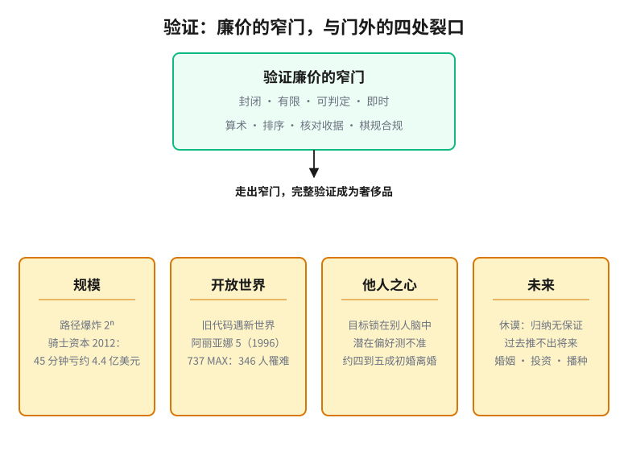

# 第 1 章　验证的奢侈

> **论点**：事前就能确认某事为真、正确或安全的「完整验证」，在人和机器的生活里是例外，不是常态。

## 七乘八，和其余的一切

你能验证七乘八等于五十六。你可以重数一遍，换个算法再算一遍，或者直接背乘法表，几秒钟之内，对错就板上钉钉。

现在换几件事。在说出「我愿意」之前，验证这段婚姻会长久；在按下上线之前，验证这个代码库一个 bug 都没有；在投入半生之前，验证你信奉的理论为真；在接下这份工作之前，验证这家公司是健康的。这些你都做不到。不是因为你不够努力，而是这类事情根本不提供「事前验证」这个选项。

这个反差是本书的第一块基石：能在事前确认某事为真、为对、为安全的「完整验证」，在人和机器的生活里是例外，不是常态。我们之所以觉得它理应是常态，只是因为我们的直觉是在一小块特别规整的地方养成的。

## 验证廉价的那一小块

哪些事我们验得了？算一道算术题，给一串数字排序，核对一张收据的总额，判断棋盘上某步走法是否合规。把这些放在一起看，会发现它们有几个不起眼的共同点：对象是封闭的（相关的东西全摆在眼前）；是有限的（情形数得过来）；答案是局部而即时的（既不依赖远处，也不依赖将来）；而且存在一个机械的判定程序（照着做，就能得到「是」或「否」）。

我们「凡事都能检验」的直觉，就是从这一小块里长出来的。学校反复奖励的，恰好是这类有标准答案、能当场批改的题目。于是我们不知不觉地把一条经验（「在我练过的事情里，对错总能查清」）推广成了一种世界观（「事情的对错总能查清」）。这个推广是错的，而且错得有规律。一旦走出这一小块，上面四个特征几乎全都不再成立。

## 错觉在四个地方破裂

**规模（scale）。** 一小块里面的情形数得过来，外面的数不过来。一个有 $n$ 个分支的程序，可能的执行路径多达 $2^n$ 条，几十个分支就足以让穷尽测试在宇宙寿命内都跑不完。这种路径爆炸（path explosion）让「全部测一遍」从一开始就没有可能。你能验证程序在你想到的那几个输入上正确，却无法验证它在所有输入上都正确。2012 年 8 月 1 日，骑士资本（Knight Capital）部署新的交易程序，八台服务器里有一台没有更新。一段沉睡多年、早该弃用的旧代码，被一个重复使用的标志位意外唤醒，在开盘后约四十五分钟里狂发数百万笔订单，让公司亏损约四亿四千万美元，几乎一夜破产。没有人验证过那条废弃的路径，因为没有人想到它还会运行。检验单个情形很容易；可量词「所有」一出现，你就进入了另一个世界。

**开放世界（open world）。** 里面的对象是封闭的，外面的世界却不断送来新东西。你测过的只是有限的几个场景，系统真正要面对的，是一个开放、还在不断展开的环境。1996 年 6 月 4 日，阿丽亚娜 5 型火箭首飞，升空约三十七秒后在空中自毁。原因是一段从阿丽亚娜 4 型直接沿用、没有针对新弹道重新验证的惯性导航代码：它把一个 64 位浮点数硬塞进 16 位整数，而新火箭更高的水平速度让这个数溢出了。连同搭载的四颗科学卫星，损失超过三亿七千万美元。这段代码在旧世界里正确运行了多年，换到新世界就要了命。波音 737 MAX 的 MCAS 系统，是同一道裂口更惨痛的版本：它在一次次试飞中表现正常，到了真实航线上，却依据一个故障迎角传感器的读数，一次又一次把机头往下压。两起空难（2018 年狮航 610 航班、2019 年埃航 302 航班）共造成 346 人遇难。你验证的永远是过去见过的那一片，要押注的却是没见过的将来。

**他人之心（other minds）。** 里面的状态可以观测，外面你要满足的目标却常常锁在另一个人的脑子里。「做得没错，可这不是我想要的」，这句常听到的抱怨，根子就在这里。用户真正想要什么，上司满不满意，对方爱不爱你，这些都是潜变量（latent variable）：你只能从行为上旁敲侧击，无法直接读出来，因而也无法直接验证自己是否满足了它。连人生中最郑重的承诺也躲不开。据人口学测算，美国约四到五成的初婚最终以离婚收场；没有谁能在说出「我愿意」的那一刻，验证这段婚姻会长久。

**未来。** 这是最深的一处裂口，休谟早在 1748 年就把它挑明了<a href="#ref-17">17</a>：归纳（induction）没有逻辑上的保证。太阳过去每天都升起，并不能从逻辑上证明它明天还会升起；有限的过去经验，无法事前验证任何关于未来的全称判断。我们依靠的不是证明，而是习惯。凡是结果落在将来的行动，婚姻、投资、播种、托付，都在这道裂口的另一边。

## 连数学和软件也不例外

也许你会想：规模、人心、未来这些偏「软」的领域认输也就罢了，数学和软件总该是完整验证的堡垒吧？事实上，正是这两个最「硬」的领域，最清醒地承认了验证的限度。

软件这边，迪杰斯特拉留下过一句被引用得烂熟、却依然正确的话：测试只能证明缺陷存在，不能证明缺陷不存在<a href="#ref-14">14</a>。他主张程序应当一开始就被正确地构造出来，而不是靠调试调出正确<a href="#ref-13">13</a>。可即便是形式化证明这条最严格的路，也有它的限度。德米洛、利普顿与佩利 1979 年那篇著名又充满争议的论文<a href="#ref-9">9</a>指出，程序验证（program verification）无法扮演数学证明那样的角色，它的可信度最终来自一个社会过程，而不是机械的推导。费泽尔 1988 年说得更重<a href="#ref-10">10</a>：程序是一个因果模型，与作为逻辑结构的算法之间隔着一道鸿沟，因此「完全可靠的程序验证」连在理论上都不成立。布鲁克斯的《没有银弹》<a href="#ref-11">11</a>断言，软件的本质复杂性（essential complexity）无法靠某一招一举消除。帕纳斯辞去了星球大战计划的顾问一职，公开论证那类系统的软件无法被验证到值得托付的程度<a href="#ref-12">12</a>。而 Therac-25 放疗机，是这一切判断用人命写下的注脚：1985 至 1987 年间，它因一个竞态条件（race condition）缺陷六度失控，把高出正常剂量上百倍的辐射打进病人体内，至少三人因此死亡<a href="#ref-15">15</a>。1968 年北约的那场会议干脆为此造了一个词：软件危机（software crisis）<a href="#ref-16">16</a>。

数学这边更是釜底抽薪。哥德尔 1931 年证明<a href="#ref-3">3</a>，任何足以表达基本算术的一致形式系统（formal system），都存在它在系统内部无法判定的真命题。丘奇与图灵 1936 年各自证明<a href="#ref-2">2</a><a href="#ref-1">1</a>，不存在能判定任意命题是否可证的算法（判定问题无解）。莱斯定理（Rice's theorem）<a href="#ref-4">4</a>把这一点推到极致：程序的任何非平凡语义性质都不可判定（undecidable）。即使某个问题原则上可判定，库克 1971 年确立的 NP 完全性（NP-completeness）<a href="#ref-5">5</a>也表明，验证的代价可能大到在实践中根本跑不动。这些不是工程上一时的短板，而是逻辑为验证划下的硬边界。下一章会专门拆解这一层。

## 这不是一句丧气话

把以上合在一起：大多数要紧的行动，都踩在未经验证的地面上。

这不是一个叫人束手无策的结论，而是一个起点。承认验证是奢侈品，是认真对待行动的第一步。奈特早在 1921 年就把可度量的「风险」与不可度量的「不确定性」区分开来<a href="#ref-22">22</a>，并指出利润来自后者。凯恩斯谈到真正的不确定性时，只留下一句「对此我们根本无从知晓」<a href="#ref-26">26</a>。西蒙看到有限的主体不可能把所有选项都验证一遍，于是提出了「满意化」（satisficing）<a href="#ref-23">23</a>。冯·诺依曼与摩根斯特恩，还有萨维奇，各自为「无法事前验证结果时如何理性下注」搭起了形式框架<a href="#ref-24">24</a><a href="#ref-25">25</a>。一整门关于决策的学问，本来就建立在「验证不可得」这个前提上。问题从来不是怎样消灭不确定性，而是怎样在不确定性中行动得当。

## 接下来

既然验证通常不可得，第一个要问的就是：它为什么不可得？

答案不止一个，而这正是关键。把「我没法检验它」当成一种处境，是这个领域最常见、也最误事的错误。它其实是五种结构完全不同的处境，共用了同一句话。下一章，我们把这句话掰成五瓣。

---

## 参考文献

> 落足点：① 历史上科学家的判断　② 理论上被研究过的东西　③ 科学如何进展　④ 如何在无法验证的世界里生活。本节经网络逐条核实。

1. A. M. Turing (1936). 「On Computable Numbers, with an Application to the Entscheidungsproblem」. Proceedings of the London Mathematical Society, s2-42, 230-265. [②]
   图灵以一台抽象计算机器为模型，证明不存在能判定任意命题是否可证的算法，并由此导出停机问题不可判定。这是把验证的极限从工程经验提升为数学定理的奠基之作，本章「连数学和软件也不例外」一节正以此说明判定问题无解。文章所在的 series 2 第 42 卷横跨 1936 至 1937 年，部分书目标作 1937，正文采用通行的 1936。

2. A. Church (1936). 「An Unsolvable Problem of Elementary Number Theory」. American Journal of Mathematics, 58(2), 345-363. [②]
   丘奇以自己创立的 lambda 演算为工具，独立证明初等数论中存在不可解的判定问题，发表比图灵早数月。它与图灵的工作殊途同归，共同框定了「什么是可计算的」这条理论边界，提示读者验证之不可得在 1936 年已由两条独立路径同时确立。

3. K. Gödel (1931). 「Über formal unentscheidbare Sätze der Principia Mathematica und verwandter Systeme I」. Monatshefte für Mathematik und Physik, 38, 173-198. [②]
   哥德尔证明，任何足够丰富而一致的形式系统都含有它自身无法证明也无法否证的真命题。这意味着「在系统内部把一切真理逐一验明」从原理上就办不到，是本章论证验证存在硬边界时最深的一块基石，下一章还会专门拆解。

4. H. G. Rice (1953). 「Classes of Recursively Enumerable Sets and Their Decision Problems」. Transactions of the American Mathematical Society, 74, 358-366. [②]
   莱斯定理把停机问题的不可判定性推到极致：程序的任何非平凡语义性质都不存在通用的判定算法。它告诉读者，关于「这段程序到底会做什么」的问题，几乎一概不可机械验证，是本章「最硬的领域也低头」一段的关键支撑。

5. S. A. Cook (1971). 「The Complexity of Theorem-Proving Procedures」. Proceedings of the 3rd Annual ACM Symposium on Theory of Computing (STOC), 151-158. [②]
   库克在此确立了 NP 完全性概念，证明可满足性问题对一大类问题具有普遍的计算难度。它揭示了验证的另一重限度：哪怕一个问题原则上可判定，求解或检验的代价也可能爆炸到实践中根本跑不完，对应本章谈「规模」失效的那一面。

6. C. A. R. Hoare (1969). 「An Axiomatic Basis for Computer Programming」. Communications of the ACM, 12(10), 576-580. [②①]
   霍尔提出以前置条件、后置条件与推理规则严格证明程序正确性的公理体系，即后世所称的霍尔逻辑。它代表了「把验证做到底」这条最严路线的雄心，读者由此能看清形式化验证能走多远，以及它在工程现实中为何始终难以覆盖全部。

7. J. C. King (1976). 「Symbolic Execution and Program Testing」. Communications of the ACM, 19(7), 385-394. [②]
   金提出符号执行：用符号变量代替具体输入，沿程序的分支系统地推演各条路径所需满足的条件。这一技术既扩大了自动测试的覆盖面，也直观暴露出路径数随分支指数增长的「路径爆炸」，正是本章用来说明穷尽验证为何受限的根本困难。

8. E. M. Clarke 与 E. A. Emerson (1981). 「Design and Synthesis of Synchronization Skeletons Using Branching Time Temporal Logic」. Logics of Programs (Lecture Notes in Computer Science 131), Springer, 52-71. [②]
   这篇工作坊论文提出用分支时序逻辑自动检验系统是否满足给定性质，开创了模型检验。它代表机器验证真正落地的一支，但其威力以系统状态有限为前提，因而恰好划出了自动验证能够触及与无能为力的边界。文章收入 LNCS 第 131 卷，属会议论文集而非期刊。

9. R. A. DeMillo, R. J. Lipton 与 A. J. Perlis (1979). 「Social Processes and Proofs of Theorems and Programs」. Communications of the ACM, 22(5), 271-280. [①②]
   三位作者论证，数学证明之所以可信，靠的是数学共同体反复阅读、复用与检验的社会过程，而冗长机械的程序验证缺乏这种过程，因而无法扮演数学证明那样的角色。这是对「形式化验证能给软件以确定性」的著名质疑，本章引它来说明验证的可信最终来自社会而非纯机械推导。

10. J. H. Fetzer (1988). 「Program Verification: The Very Idea」. Communications of the ACM, 31(9), 1048-1063. [①②]
   费泽尔把质疑推得更深：算法是逻辑结构，可被严格证明，而在真实机器上运行的程序是因果模型，其行为受硬件与世界制约，二者之间有一道无法弥合的鸿沟。他据此主张「完全可靠的程序验证」连理论上都不成立。此文引发 1989 年技术通信的大规模论战，是本章界定验证逻辑边界的重要一环。

11. F. P. Brooks (1987). 「No Silver Bullet: Essence and Accidents of Software Engineering」. IEEE Computer, 20(4), 10-19. [①]
   布鲁克斯区分软件的本质复杂性与附属复杂性，断言没有任何单一技术能在十年内让软件生产率有数量级提升，本质复杂性无法被一招消除。它支撑了本章的判断：缺陷不可能被某种银弹一举验证清除。此文原为 1986 年 IFIP 第 10 届世界计算机大会的邀请论文，初刊于 Information Processing 86, 1069-1076。

12. D. L. Parnas (1985). 「Software Aspects of Strategic Defense Systems」. Communications of the ACM, 28(12), 1326-1335. [①]
   帕纳斯在辞去星球大战计划顾问后撰文，逐条论证此类系统的软件无法经测试或证明而被验证到值得托付的程度。这是一位顶尖工程师以辞职为代价对验证极限作出的公开判断，本章引为「连最硬的领域也低头」的现实注脚。同年他另以系列短文见于 American Scientist。

13. E. W. Dijkstra (1972). 「The Humble Programmer」（1972 ACM 图灵奖演讲）. Communications of the ACM, 15(10), 859-866. [①]
   这是迪杰斯特拉的图灵奖演讲，主张程序员应保持谦卑，正视人脑容量有限，并把程序当作应当被正确地构造出来的对象，而非靠事后调试修补成正确。它反映了一位奠基者对事后验证之局限的清醒判断，与本章主张相互呼应。

14. E. W. Dijkstra (1972).《Notes on Structured Programming》（载于 O.-J. Dahl, E. W. Dijkstra, C. A. R. Hoare 编《Structured Programming》）. Academic Press. [①]
   本章那句被引滥却仍正确的话「测试只能证明缺陷的存在，不能证明其不存在」即出于此文。迪杰斯特拉在此系统阐述结构化程序设计，主张通过有纪律的构造而非穷举测试来获得正确性。该论断最早见于手稿 EWD249（1970），1972 年收入《Structured Programming》正式出版。

15. N. G. Leveson 与 C. S. Turner (1993). 「An Investigation of the Therac-25 Accidents」. IEEE Computer, 26(7), 18-41. [①④]
   两位作者对 Therac-25 放疗机因软件缺陷导致患者受过量辐射乃至死亡的系列事故作了权威调查，剖析了竞态条件、过度信任软件与缺乏独立安全机制等连锁原因。它以人命为代价说明，安全攸关系统未经充分验证即投用会有什么后果，是本章关于验证代价的沉重注脚。

16. P. Naur 与 B. Randell（编）(1969).「Software Engineering: Report on a Conference Sponsored by the NATO Science Committee」. Scientific Affairs Division, NATO. [①]
   这份会议报告记录了从业者对当时软件普遍超期、超支、难以可靠交付的集体焦虑，「软件危机」一词与「软件工程」这门学科的提法即由此而来。它是本章那句「软件危机」的源头，集中呈现了一代工程师对软件无法被可靠验证的判断。会议于 1968 年 10 月在德国 Garmisch 召开，报告 1969 年出版。

17. D. Hume (1748).《An Enquiry Concerning Human Understanding》. (London). [④③]
   休谟在此挑明了归纳问题：由过去屡屡如此推断将来仍会如此，并无逻辑上的保证，太阳明日是否升起无法事前证明，人之所以照常行动靠的是习惯而非证明。这是本章「未来」一处裂口的思想源头，也是全书反复回到的起点。本书 1748 年初版原题《Philosophical Essays Concerning Human Understanding》，1758 年改为今题。

18. K. Popper (1959).《The Logic of Scientific Discovery》. Hutchinson. [③]
   波普尔系统提出证伪主义：科学理论无法被经验证实，只能被否证，可证伪性因而成为科学与非科学的分界，科学也正是经由不断尝试推翻理论而进展。它直接关系到本章「科学如何进展」这一落足点，揭示连科学也不靠正面验证累积。英文版系作者在德文原著《Logik der Forschung》（1934 年付印，版权页标 1935）基础上扩写而成。

19. W. V. O. Quine (1951). 「Two Dogmas of Empiricism」. The Philosophical Review, 60(1), 20-43. [③]
   蒯因批判分析与综合的截然二分以及还原论这两个经验论教条，提出整体论：理论是一张面对经验整体受检的信念之网，任何单个陈述都无法被孤立地验证或反驳。它说明证据对理论的检验是欠决定的，深化了本章关于科学如何进展、验证为何不可逐句完成的讨论。

20. T. S. Kuhn (1962).《The Structure of Scientific Revolutions》. University of Chicago Press. [③]
   库恩提出范式概念，描述科学如何在常规科学的积累与反常累积所引发的危机之间交替，最终经由范式转换而发生革命。其要点是科学并非靠对真理的逐步验证线性累积，而是经由不可通约的范式跃迁。它为本章「科学如何进展」提供了与波普尔互补又对照的图景。

21. I. Lakatos (1976).《Proofs and Refutations: The Logic of Mathematical Discovery》（J. Worrall 与 E. Zahar 编）. Cambridge University Press. [③②]
   拉卡托斯以多面体欧拉公式的演变为课堂对话，展示数学概念与定理如何在反例、再证明与定义修订的往复中成长。它颠覆了「数学证明是一劳永逸的验证」这一印象，提示连最确定的领域也经由批判而推进，呼应本章对验证之有限的总论。

22. F. H. Knight (1921).《Risk, Uncertainty and Profit》. Houghton Mifflin. [④]
   奈特把可用概率度量的「风险」与无从度量的真正「不确定性」区分开来，并论证企业家的利润正源于承担后者。这一区分是本章承认验证是奢侈品后转向行动理论的关键，它说明在无法事前验明结果的局面下，决策与回报如何获得意义。

23. H. A. Simon (1955). 「A Behavioral Model of Rational Choice」. The Quarterly Journal of Economics, 69(1), 99-118. [④]
   西蒙提出有限理性的行为模型：信息与计算能力都受限的主体无法穷尽比较所有选项，只能设定一个够用的水准，找到满足它的方案便停下，即「满意化」。这正是本章主张的「在不确定里如何行动得当」的一个具体答案，把验证不可得转化为可操作的决策准则。

24. J. von Neumann 与 O. Morgenstern (1944).《Theory of Games and Economic Behavior》. Princeton University Press. [④]
   两位作者奠定了博弈论，并以一组公理推出期望效用，论证理性主体应据期望效用作选择。它为「在无法事前验明对手意图与结果的情形下如何理性地下注」搭起了形式框架，是本章所说那门建立在验证不可得之上的决策学问的支柱之一。

25. L. J. Savage (1954).《The Foundations of Statistics》. John Wiley & Sons. [④]
   萨维奇为主观概率与个人主义决策论建立公理基础，证明只要偏好满足若干一致性条件，主体的行为就如同依据某个主观概率与效用在最大化期望效用。它给出了在无法客观验证概率的世界里仍能一致下注的理性标准，与冯·诺依曼的框架共同支撑本章对不确定下决策的讨论。

26. J. M. Keynes (1937). 「The General Theory of Employment」. The Quarterly Journal of Economics, 51(2), 209-223. [④]
   凯恩斯在回应对《通论》的批评时，强调真正的不确定性不可用概率度量，对有些事情「关于此我们根本无从知晓」。他指出投资决策在无法验证的未来面前只能依赖惯例与动物精神。本章那句对真正不确定的经典陈述即出于此，它佐证了决策学问以验证不可得为前提。

27. A. Tversky 与 D. Kahneman (1974). 「Judgment under Uncertainty: Heuristics and Biases」. Science, 185(4157), 1124-1131. [④]
   特沃斯基与卡尼曼通过实验表明，人在判断概率时常依赖代表性、可得性与锚定等启发式捷径，因而系统性地偏离概率规范。它从描述的层面补全了本章的图景：在无法完整验证概率的世界里，人实际怎样判断，又会一致地错在哪里。

28. N. N. Taleb (2007).《The Black Swan: The Impact of the Highly Improbable》. Random House. [④]
   塔勒布称那些罕见、极端冲击且事后才被强行解释的事件为黑天鹅，主张它们无法被事前验证或预测，却往往主导历史走向。他据此提议人应放弃精确预测的幻想，转而构建能在意外面前不被摧毁甚至受益的安排。这呼应本章的结尾：问题不在取消不确定，而在不确定里如何活得稳妥。
