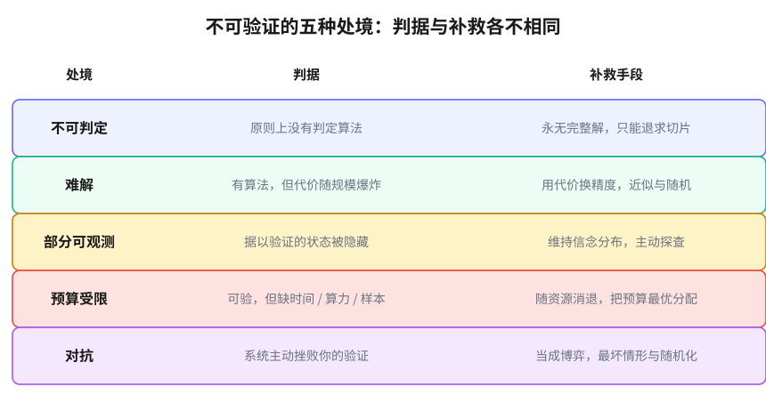

# 第 2 章　不可验证的五副面孔

> **论点**：「我没法检验它」掩盖了五种结构不同的处境，把它们混为一谈是这个领域的核心错误。

一句「我没法检验它」，听上去像一种处境，其实掩着五种。它们结构全然不同，可得的补救也全然不同，把它们混为一谈是这个领域最核心的错误。

这一章要做的，是把五种掰开、各自掐准。这件事看似只是分类的洁癖，实则是全书后半部分的信用额度。本书最终要论证：尽管不可验证的来源天差地别，应对却收敛到同一小套。这个论断要想不显得廉价，前提就是先把「天差地别」坐实。差异讲得越透，后面那份收敛才越是值得惊讶、值得解释。请把这五副面孔记牢，它们会在全书反复点名。

## 第一副：不可判定

判据：原则上就不存在判定它的算法。不是难，是没有。

这是验证最硬的失败。希尔伯特与阿克曼 1928 年<a href="#ref-4">4</a>明确提出判定问题（Entscheidungsproblem），问能否有一个机械程序，对任意数学命题判定其真伪。八年后，丘奇<a href="#ref-2">2</a>用 lambda 演算、图灵<a href="#ref-1">1</a>用他那台抽象机器，各自证明不能。图灵的停机问题（halting problem）尤其干净，没有算法能对任意「程序加输入」判定它是否会停下。哥德尔 1931 年<a href="#ref-3">3</a>的不完备性（incompleteness）、赖斯定理<a href="#ref-6">6</a>（Rice's theorem，程序的任何非平凡语义性质都不可判定）、马蒂亚谢维奇 1970 年<a href="#ref-7">7</a>对希尔伯特第十问题的否决，都属于这一族。这并非纸上空谈：正因为「这段程序会不会做坏事」可归约到停机问题，理论上就不存在一款杀毒软件能完美无误地查出所有恶意程序，这是逻辑替反病毒行业划下的天花板。

这副面孔的补救有一个独一无二的性质：永远不会有完整解。再多的时间、再快的机器都不行，因为障碍是逻辑的，不是资源的。你能做的，只有退而求其次，验证有限的切片，或把自己限制在那些确实可判定的片段里（比如只有加法的算术）。这一点会一直回响到第 7 章。

## 第二副：难解

判据：算法存在，但它的代价随规模爆炸，大到实践中跑不完。

这一副和上一副差之毫厘，谬以千里：可判定，却不可行。库克 1971 年<a href="#ref-8">8</a>、列文 1973 年<a href="#ref-9">9</a>各自确立的 NP 完全性（NP-completeness），卡普 1972 年<a href="#ref-10">10</a>著名的二十一个 NP 完全问题，给了它精确的刻画。最坏情形的可满足性问题（satisfiability）、无数组合优化问题，原则上都有解法，但那解法在最坏情形下的耗时随输入规模呈指数增长，

$$T(n)\sim 2^{n},$$

几十个变量就足以让最快的超算望洋兴叹。一个量级上的直觉：国际象棋的博弈树约有 $10^{120}$ 个分支（香农数），围棋的合法局面约 $2\times10^{170}$ 个，而整个可观测宇宙的原子数也不过约 $10^{80}$。这些棋类规则简单、原则上可穷举，可那个「原则上」远在物理可能性之外。$\mathsf{P}$ 是否等于 $\mathsf{NP}$，正是在问这道墙是不是注定的。

它的补救与不可判定（undecidable）完全不同。这里多投入资源是有意义的，更要紧的是，你可以用「接受少一点」来换「付得起的代价」：近似解代替精确解、平均情形代替最坏情形、启发式搜索、随机化。难解（intractable）逼出的是一整套「打折」的智慧，这在不可判定那里是没有的。

## 第三副：部分可观测

判据：你要据以验证的那个状态，对你是隐藏的。

不是没有判定程序，也不是代价太大，而是你压根看不到该看的东西。用户真正的偏好、病人体内正在发生什么、对手手里的牌，这些驱动结果的状态却不对你显现。控制论很早就形式化了它：阿斯特罗姆 1965 年<a href="#ref-15">15</a>研究状态信息不完整下的最优控制，斯莫尔伍德与桑迪克 1973 年<a href="#ref-16">16</a>、凯尔布林等人 1998 年<a href="#ref-18">18</a>把它发展成部分可观测马尔可夫决策过程（POMDP）这一标准框架。帕帕迪米特里乌与齐齐克利斯 1987 年<a href="#ref-17">17</a>还证明，求解这类问题本身又是难解的，于是第三副面孔常和第二副叠在一起。

它的补救自成一类：你不再追求一个确定的判决，而是维持一个关于隐藏状态的信念分布（belief state），并用每一次观测去更新它，

$$b'(s')\ \propto\ \Pr(o\mid s')\sum_{s}\Pr(s'\mid s,a)\,b(s).$$

推断与探查，而不是「算得更狠」，才是这一副的解药。第 5 章整章都在这副面孔里。

## 第四副：预算受限

判据：原则上可验、可解，但你这个主体，此时此地，没有那个时间、算力或样本。

这一副最朴素，也最普遍。一个评审只有二十分钟看一篇论文；一个医生只有几分钟做诊断；一个交易员必须在行情消失前下单。验证在理论上完全可行，落到一个有限的主体身上却不可行。奈特 1921 年<a href="#ref-19">19</a>、西蒙 1955 年<a href="#ref-20">20</a>的有限理性（bounded rationality）是它的思想源头；迪安与博迪 1988 年<a href="#ref-22">22</a>的随时算法（anytime algorithm，随时可中断、给出当前最优解）、拉塞尔与苏布拉马尼安 1995 年<a href="#ref-23">23</a>的「有界最优」（bounded optimality），是它的形式化。

它的补救有一个别的面孔都没有的特征：这副面孔会随资源增长而消退。给足时间和算力，它就消失了。正因如此，对付它的核心在分配，把稀缺的预算花在边际收益最高处。这条思路，正是后面「最优筛查」那一招的来历。

## 第五副：对抗

判据：你面对的那个系统，在主动地挫败你的验证。

前四副里，难处来自世界的中立属性，逻辑的、规模的、可见性的、资源的。第五副不同：对面有一个智能，在针对你的检查做优化。会撒谎的对手、会伪装的恶意代码、会操纵指标的被考核者。冯·诺依曼与摩根斯特恩 1944 年<a href="#ref-24">24</a>的博弈论（game theory）、纳什 1950 年<a href="#ref-25">25</a>的均衡（Nash equilibrium）、瓦尔德 1945 年<a href="#ref-26">26</a>的极小极大准则（minimax），是它的经典理论；塞盖迪等人 2014 年<a href="#ref-29">29</a>发现的对抗样本（adversarial examples）、马德里等人 2018 年<a href="#ref-31">31</a>用鲁棒优化（robust optimization）统一攻防，是它在机器学习里的当代化身。一个识别率极高的模型，可以被人眼察觉不到的微小扰动骗得一塌糊涂，因为有人专门去找那个扰动。研究者们做过一个反复被复现的演示：只要在一个停车标志上贴几张精心设计、看似涂鸦的小贴纸，就能让顶尖的图像识别系统稳定地把它读成限速牌。同一张标志，人看是停，机器看是行，差别只在对手往哪儿贴。

它的补救是战略，不是计算。你要做的不是把某个量算得更准，而是

$$\min_{x}\ \max_{y}\ L(x,y),$$

按最坏情形布防，用随机化剥夺对手对你的预测，追求在博弈里站得住而非在某个固定输入上最优。把对抗（adversarial）当成单纯的可观测缺口（「我只是还没看清它」）来处理，是会出人命的误判，因为它会顺着你的判断调整自己。

## 五副面孔，五种解药

把它们并排放好，要紧的不是名字，是它们的补救彼此不可通约：

- 不可判定，永无完整解，只能退求切片。
- 难解，可用代价换精度，多投资源有意义。
- 部分可观测，靠推断信念、主动探查。
- 预算受限，随资源消退，核心在分配。
- 对抗，是一盘棋，靠战略与随机。

谁要是对你说「这事多堆点算力就解决了」，那他多半是把某一副面孔错认成了另一副。把不可判定当成预算问题、把对抗当成可观测问题，都是这种错认，而且代价高昂。

这些面孔还会叠加、复合。第 6 章那个放出去的智能体，同时撞上开放世界的不可预测（近乎不可判定的行为）和对手的策略性（对抗）；第 8 章那个组织，将部分可观测和对抗一起扛。真实处境往往是好几副面孔的混合。

正因为来源如此参差、补救如此各异，下一个该问的问题就尖锐起来了：人类有没有一套成熟的办法，长期地、有纪律地与不可验证共处？有的。那套办法叫科学，而它的第一条家规恰恰是公开承认自己永远无法验证。

---

## 参考文献

> 落足点：① 历史上科学家的判断　② 理论上被研究过的东西　③ 科学如何进展　④ 如何在无法验证的世界里生活。本节经网络逐条核实。

### 不可判定（②③）

1. A. M. Turing (1936).「On Computable Numbers, with an Application to the Entscheidungsproblem」. Proceedings of the London Mathematical Society, s2-42(1), 230–265. [②③]
   图灵在此引入「可计算数」与抽象计算机器的概念，并由停机问题的不可解推出判定问题没有机械解法。这篇论文是「不可判定」这副面孔最干净的样板：障碍是逻辑的而非资源的，本章正以图灵机器与停机问题作为该副面孔的标准例证。
2. A. Church (1936).「An Unsolvable Problem of Elementary Number Theory」. American Journal of Mathematics, 58(2), 345–363. [②③]
   丘奇用他发展的 lambda 演算证明初等数论中存在不可解问题，从而独立地否决了判定问题，发表上还早于图灵约七个月。它与图灵的结果互为印证，共同坐实了「原则上就不存在判定算法」并非个别现象，本章把两者并列为不可判定一族的开端。
3. K. Gödel (1931).「Über formal unentscheidbare Sätze der Principia Mathematica und verwandter Systeme I」. Monatshefte für Mathematik und Physik, 38, 173–198. [②③]
   哥德尔在此证明不完备性定理：任何足够强的一致形式系统中都存在既不能证明也不能否证的命题。它是不可判定谱系的源头，表明形式方法本身有原则上的极限，本章把它列为这副面孔最早的一记警钟。
4. D. Hilbert & W. Ackermann (1928).《Grundzüge der theoretischen Logik》. Springer. [②③]
   这本数理逻辑教科书第一次明确提出判定问题，即追问是否存在一个机械程序，能对任意数学命题判定真伪。正是这个问题催生了丘奇与图灵的否定证明，本章以它作为不可判定面孔的出发点，读者可借此看清当年的乐观期待与随后的逻辑碰壁。
5. E. L. Post (1944).「Recursively Enumerable Sets of Positive Integers and Their Decision Problems」. Bulletin of the American Mathematical Society, 50(5), 284–316. [②③]
   波斯特在此系统研究递归可枚举集及其判定问题，并提出后来催生不可解度理论的思路。它把「不可判定」从单个问题推进到对不可解性结构的分级研究，本章引它说明该副面孔有自身的层次与谱系，而非铁板一块。
6. H. G. Rice (1953).「Classes of Recursively Enumerable Sets and Their Decision Problems」. Transactions of the American Mathematical Society, 74(2), 358–366. [②]
   赖斯定理在此确立：程序所计算的任何非平凡语义性质都不可判定。它把图灵式的不可判定从个别问题推广为一条普遍铁律，本章引它说明，想机械地验证程序「做的对不对」这类问题，原则上就堵死了。
7. Y. V. Matiyasevich (1970).「Enumerable Sets Are Diophantine」. Soviet Mathematics. Doklady, 11(2), 354–357. [②③]
   马蒂亚谢维奇在此补上最后一环，证明每个递归可枚举集都是丢番图集，由此完成希尔伯特第十问题不可解的证明，即 MRDP 定理。它说明连「丢番图方程有无整数解」这样具体的数学问题都没有判定算法，本章引它佐证不可判定并不限于自指或元数学，而是渗进了寻常数学。

### 难解（②③）

8. S. A. Cook (1971).「The Complexity of Theorem-Proving Procedures」. Proceedings of the 3rd Annual ACM Symposium on Theory of Computing (STOC), 151–158. [②③]
   库克在此开创 NP 完全性概念，证明可满足性问题是 NP 中最难的一类。它给「难解」这副面孔下了精确定义：问题有解法，代价却随规模爆炸。本章以它划清第二副与第一副的界限，即「可判定却不可行」不同于「根本没有算法」。
9. L. A. Levin (1973).「Universal Sequential Search Problems」. Problems of Information Transmission, 9(3), 265–266. [②③]
   列文在铁幕另一侧独立得到与库克相同的结果，给出通用搜索问题的完全性刻画，两者合称 Cook-Levin 定理。它说明 NP 完全性的发现是收敛而非偶然，本章引它强化「难解」这副面孔的客观性：这是问题结构本身的性质，不因研究路径而异。
10. R. M. Karp (1972).「Reducibility Among Combinatorial Problems」. In R. E. Miller & J. W. Thatcher (Eds.),《Complexity of Computer Computations》(pp. 85–103). Plenum Press. [②③]
   卡普用多项式归约证明了二十一个常见组合问题都是 NP 完全的，把库克的单个结果扩展成一张相互归约的网。它表明难解不是个别难题的怪癖，而是横跨调度、划分、覆盖等大量实际问题的普遍现象，本章引它说明这副面孔在工程中无处不在。
11. J. Hartmanis & R. E. Stearns (1965).「On the Computational Complexity of Algorithms」. Transactions of the American Mathematical Society, 117, 285–306. [②]
   这篇论文用图灵机的运行时间为算法定级，奠定了按资源消耗划分复杂度类的框架，「计算复杂度」一词也由此确立。它提供了度量「难解」所必需的标尺，本章引它说明第二副面孔之所以能被精确谈论，前提是先有了刻画代价随规模如何增长的语言。
12. M. R. Garey & D. S. Johnson (1979).《Computers and Intractability: A Guide to the Theory of NP-Completeness》. W. H. Freeman. [②]
   这本书系统整理了 NP 完全性理论与证明技巧，并附上一份广为引用的难解问题清单，长期被当作该领域的标准参考。对想由头了解「难解」这副面孔的读者，它既是入门指南也是工具书，本章把它列为该主题最可靠的落脚处。
13. M. Sipser (2012).《Introduction to the Theory of Computation》(3rd ed.). Cengage Learning. [②]
   这本广受采用的本科教材清晰讲解自动机、可计算性与复杂度，把图灵机、停机问题、P 与 NP 等概念串成一条连贯的线。它正好覆盖本章前两副面孔的理论底子，是想从头打基础的读者最稳妥的起点，初版可上溯到 1997 年。
14. S. Arora & B. Barak (2009).《Computational Complexity: A Modern Approach》. Cambridge University Press. [②]
   这本研究生教材覆盖了从经典复杂度类到随机化、交互证明、近似与去随机化等现代主题，视野远超入门教科书。对想深入「难解」这副面孔，尤其想理解人们如何用近似与随机绕开最坏情形的读者，它是更进一步的权威读物。

### 部分可观测（②④）

15. K. J. Åström (1965).「Optimal Control of Markov Processes with Incomplete State Information」. Journal of Mathematical Analysis and Applications, 10, 174–205. [②]
   阿斯特罗姆在此研究状态信息不完整下的最优控制，提出用关于隐藏状态的概率分布即「信念状态」来概括所有可得信息。这是 POMDP 理论的源头之一，也正是本章为「部分可观测」开出的解药：不追求确定判决，而是维持并更新一个信念。
16. R. D. Smallwood & E. J. Sondik (1973).「The Optimal Control of Partially Observable Markov Processes over a Finite Horizon」. Operations Research, 21(5), 1071–1088. [②]
   这篇论文给出有限时域 POMDP 的经典结构性结果，并据此设计出可计算最优策略的方法。它把阿斯特罗姆的信念状态思想推进为可操作的算法，本章引它说明「靠推断信念」并非空话，而有成形的求解技术支撑。
17. C. H. Papadimitriou & J. N. Tsitsiklis (1987).「The Complexity of Markov Decision Processes」. Mathematics of Operations Research, 12(3), 441–450. [②]
   这篇论文系统刻画了马尔可夫决策过程各变体的计算复杂度，证明引入部分可观测会让求解显著变难。它把第三副与第二副面孔扣在一起：看不见正确状态的处境，求解本身往往又是难解的，本章正以此说明面孔会彼此叠加。
18. L. P. Kaelbling, M. L. Littman & A. R. Cassandra (1998).「Planning and Acting in Partially Observable Stochastic Domains」. Artificial Intelligence, 101(1), 99–134. [②④]
   这篇论文把 POMDP 整理为人工智能里的标准框架，统一了信念更新、规划与行动，并给出可实践的算法。它是「部分可观测」处境最常被引用的代表性文献，本章第 5 章对该副面孔的展开正以此为底本，读者可由它系统了解推断加探查的整套做法。

### 预算受限（①④，含有限理性与 anytime 算法）

19. F. H. Knight (1921).《Risk, Uncertainty and Profit》. Houghton Mifflin. [①④]
   奈特在此区分可用概率刻画的「风险」与无法量化的「不确定性」，后者即没有可靠概率可依的处境。这一区分是本书谈不可验证的思想起点之一，它提醒读者：有些处境的难处不在算得不够准，而在连下注所需的概率都不存在。
20. H. A. Simon (1955).「A Behavioral Model of Rational Choice」. The Quarterly Journal of Economics, 69(1), 99–118. [①④]
   西蒙在此提出有限理性：真实主体的算力、时间与信息都有限，于是不去求全局最优，而是「满意即止」。这是「预算受限」面孔的概念源头，本章借它点明，许多验证在理论上可行，落到一个有限的主体身上却必须打折，从而引出后面关于预算分配的思路。
21. M. Boddy & T. Dean (1989).「Solving Time-Dependent Planning Problems」. Proceedings of the 11th International Joint Conference on Artificial Intelligence (IJCAI). [②④]
   这篇论文延续作者的随时算法工作，研究如何在计算时间本身受限时安排规划，让系统随时可中断并交出当前最优解。它与下一条同源，本章引这一系列工作来说明「预算受限」面孔的应对核心是把有限的时间花在边际收益最高处。
22. T. Dean & M. Boddy (1988).「An Analysis of Time-Dependent Planning」. Proceedings of the 7th National Conference on Artificial Intelligence (AAAI), 49–54. [②④]
   这篇论文正式提出随时算法的概念：算法可在任意时刻被打断并给出当前最优解，质量随计算时间稳步提升。它是「预算受限」处境的代表性形式化，本章引它说明这副面孔的独特之处在于会随资源增长而消退，因而应对的关键落在分配而非纯算力。
23. S. J. Russell & D. Subramanian (1995).「Provably Bounded-Optimal Agents」. Journal of Artificial Intelligence Research, 2, 575–609. [②④]
   这篇论文把有限理性形式化为「有界最优」：不再要求智能体输出最优决策，而是要求它在给定的计算资源约束下做到所能做的最好。它给西蒙的直觉提供了精确定义，本章引它说明「预算受限」处境也能被严肃地理论化，而非只是无可奈何的妥协。

### 对抗（②①④，含决策论与对抗机器学习）

24. J. von Neumann & O. Morgenstern (1944).《Theory of Games and Economic Behavior》. Princeton University Press. [②①]
   这本书奠定了博弈论，把多方在利益冲突下的互动当作可严格分析的对象，并系统化了零和博弈的极小极大定理。它是「对抗」面孔的理论源头，本章正以它支撑该副的核心主张：面对会针对你优化的对手，要按最坏情形布防，而非在某个固定输入上求最优。
25. J. F. Nash (1950).「Equilibrium Points in N-Person Games」. Proceedings of the National Academy of Sciences, 36(1), 48–49. [②]
   纳什在这篇短文中证明，任意有限的多人博弈都存在均衡点，即没有任何一方能靠单方面改变策略获益的稳定局面。纳什均衡把博弈分析从零和推广到一般情形，本章引它作为「对抗」面孔的核心概念，帮助读者理解策略性互动如何收敛到可预期的稳定结构。
26. A. Wald (1945).「Statistical Decision Functions Which Minimize the Maximum Risk」. Annals of Mathematics, 46(2), 265–280. [②]
   瓦尔德在此奠定统计决策理论，提出以极小极大准则选择决策，即在最坏情形下使风险最小。它把「按最坏情形布防」从博弈搬进统计推断，本章引它说明对抗面孔的解药是一种战略姿态：当对手会顺着你的判断调整时，求稳比求某一处的最优更要紧。
27. L. J. Savage (1954).《The Foundations of Statistics》. Wiley. [②①]
   萨维奇在此为主观期望效用理论建立公理基础，论证一个理性主体的偏好可被表示为对主观概率求期望效用。它是不确定性下决策的标准框架，本章引它代表「用概率与效用为不确定性立账」的正统立场，也为下一条揭示该立场的边界做了铺垫。
28. D. Ellsberg (1961).「Risk, Ambiguity, and the Savage Axioms」. The Quarterly Journal of Economics, 75(4), 643–669. [①④]
   埃尔斯伯格用一个简单赌局实验揭示：人们普遍回避概率本身不明的「模糊」选项，这种行为违反了萨维奇的公理。它从经验层面印证了奈特对风险与不确定性的区分，本章引它说明概率框架并非万能，有些不可验证的处境连概率都给不出。
29. C. Szegedy, W. Zaremba, I. Sutskever, J. Bruna, D. Erhan, I. Goodfellow & R. Fergus (2014).「Intriguing Properties of Neural Networks」. International Conference on Learning Representations (ICLR). arXiv:1312.6199. [②]
   这篇论文首次系统揭示对抗样本：对图像施加人眼几乎察觉不到的微小扰动，就能让识别率极高的神经网络出错。它把「对抗」面孔带进现代机器学习，本章引它说明，只要有人专门去找那个扰动，再准的模型也会被骗，这正是对抗不同于单纯可观测缺口的地方。
30. I. J. Goodfellow, J. Shlens & C. Szegedy (2015).「Explaining and Harnessing Adversarial Examples」. International Conference on Learning Representations (ICLR). arXiv:1412.6572. [②]
   这篇论文把对抗样本归因于模型在高维空间的线性性，提出快速生成扰动的 FGSM 方法，并用对抗训练加以防御。它既解释了对抗样本为何普遍，又给出最早的应对手段，本章引它说明对抗面孔的攻与防是一对此消彼长、需要持续博弈的过程。
31. A. Madry, A. Makelov, L. Schmidt, D. Tsipras & A. Vladu (2018).「Towards Deep Learning Models Resistant to Adversarial Attacks」. International Conference on Learning Representations (ICLR). arXiv:1706.06083. [②④]
   马德里等人把对抗鲁棒性写成一个极小极大优化问题：内层找最坏扰动，外层训练抵御它，并以投影梯度下降作为标准攻击。它用鲁棒优化的语言统一了攻与防，正好把本章对抗面孔与最坏情形决策的主张落到机器学习里，是该方向影响深远的一篇。
32. B. Biggio & F. Roli (2018).「Wild Patterns: Ten Years after the Rise of Adversarial Machine Learning」. Pattern Recognition, 84, 317–331. [②]
   这篇综述回顾对抗机器学习十年的发展，指出该领域在深度学习走红前就已起步，并梳理了攻击模型、威胁建模与防御的整体脉络。对想从全局把握「对抗」面孔的读者，它是权威的总览，本章引它作为该副面孔最适合通读的落脚点。
