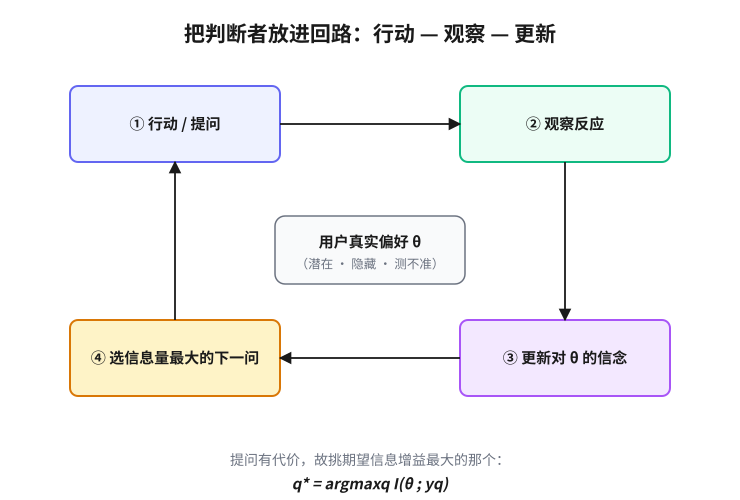

# 第 5 章　控制台前的人

> **论点**：当你必须满足的是一个人的真实偏好或意图时，你面对的是永久的部分可观测，潜在目标无法直接读出，而有能力的应对是把一个有判断力的主体放进回路，并省着、聪明地去问它。

## 你要的不是你说的

一个被反复讲烂、却始终成立的场景：用户描述了他想要的东西，工程师严丝合缝地造了出来，交付那天，用户却说，不，这不是我要的。

没有人撒谎。用户说的是真话，工程师也照做了。出问题的地方在更深处：用户真正想要的那个东西，从一开始就没有、也无法被完整地说出口。这一章看的是，当你必须满足的目标藏在另一个人的脑子里时，有能力的人怎么办。这里的不可验证，属于第 2 章那五种处境中的「部分可观测」（partial observability）：相关的状态对你隐藏着，而且不是暂时隐藏，是永久隐藏。你没法把目标从一个人的脑子里读出来，于是也没法验证你究竟满足了它。

## 潜在的偏好

把这件事说准。用户的真实偏好，是一个潜在变量（latent variable）。它驱动着他的反应，却从不直接显现，你只能从他的行为里旁敲侧击地推断。

更麻烦的是，这个潜在目标常常连用户自己都读不出来。心理学家斯洛维奇<a href="#ref-11">11</a>有一个不讨喜却扎实的论断：偏好在很多时候不是被表达的，而是在被询问的那一刻才被构造出来。你问一个人想要什么，他给你的答案，往往是被你的问法、被当时的选项、被他刚好想到的参照点一起塑造而成的，而不是从某个早已存在、定义清晰的偏好库里取出来的。这意味着「先把需求问清楚，再去实现」这个看似稳妥的次序，建立在一个常常不成立的假设上：假设那个需求作为一个确定的对象，先于询问而存在。

于是你面对的不是一个「信息暂时缺失、补齐即可」的处境。哪怕用户全程配合、知无不言，目标依然测不准。这是部分可观测最纯粹的人形版本。

## 问一次为什么不够

如果偏好是个固定的靶子，问一次、问清楚，原则上就够了。它不是。

经济学早就分开了两样东西：陈述的偏好（stated preference，一个人说他要什么）和显示的偏好（revealed preference，一个人的实际选择暴露出他要什么），二者经常对不上。需求文档是有损压缩：把一个活的、随情境变化的意图，压成一份静态的条目清单，丢掉的正是那些当时没想到、却在见到成品后立刻能指出来的东西。而且意图本身会漂移，人在看到一个具体实现之后，偏好会被这个实现重新校准，他现在想要的已经不是项目启动时想要的了。

所以「问一次」失败，不是因为你问得不够好，而是因为这个对象的性质决定了单次询问无法锁定它。能应对它的，只有一种结构：不断地行动、观察、再修正。

## 第一招：把判断者放进回路

第一种应对，是承认你读不出目标，于是在每个决策点引入那个唯一知道目标的主体，让它来纠偏。行动，观察反应，更新，再行动。把人放进回路（human in the loop）。

这条回路在很多领域各自被重新发明过。人因工程里，谢里登<a href="#ref-12">12</a>的「人类监督控制」（human supervisory control）把人定位为在自动化之上进行监督与干预的判断者，而不是被一份规格一次性替代掉的角色。可用性工程里，古尔德与刘易斯 1985 年<a href="#ref-20">20</a>那篇经验之谈，把它压成三条朴素到几乎像废话、却被无数项目违反的原则：尽早且持续地关注用户，做经验性的测量，迭代式地设计。尼尔森<a href="#ref-19">19</a>后来把它工程化成一整套可用性方法，还给出一个让人意外的经验数字：只需五位用户做测试，就能发现约八成五的可用性问题，于是与其一次请二十人，不如分四轮、每轮五人，边测边改。推荐系统从用户的点击、停留、跳过里学习他没说出口的口味，本质上也是同一条回路。霍维茨 1999 年<a href="#ref-22">22</a>的混合主动式界面（mixed-initiative user interface）、费尔斯与奥尔森 2003 年<a href="#ref-23">23</a>提出的交互式机器学习（interactive machine learning），讲的都是人与系统轮流出招、彼此校准的同一件事。

这里要防一个叙述上的塌缩：交互式获取不是某一种具体技术，它是一个方法族。实验设计、主动学习、序贯决策，乃至强化学习里的探索，都是这条「行动-观察-更新」回路在不同假设下的实例。把它说成「就是 A/B 测试」或「就是某个算法」，会把一个普遍的姿势矮化成一件工具。

## 第二招：把每一次提问花在刀刃上

回路要转，就得不断向人提问，而提问是有代价的。用户的耐心、注意力、时间，都是稀缺的；问得太多太笨，人会烦、会敷衍、会离开。于是第二招登场：既然查验有成本，就把有限的提问花在信息量最大的地方。

这一招有干净的理论。林德利 1956 年<a href="#ref-1">1</a>给出一个实验所提供的信息的度量，霍华德 1966 年<a href="#ref-3">3</a>提出信息的价值理论（information value theory），把「该不该花代价去获取这条信息」变成一个可计算的决策。贝叶斯实验设计（Bayesian experimental design，查洛纳与韦尔迪内利<a href="#ref-5">5</a>的综述是一份好地图）把它系统化：在所有可问的问题里，挑那个期望最能压缩你不确定性的。形式上，若 $\theta$ 是你想推断的潜在偏好，$y_q$ 是问题 $q$ 的回答，你要挑的是让期望信息增益最大的 $q$：

$$q^\star=\arg\max_q\; \mathbb{E}_{y_q}\big[\,\mathrm{H}(\theta)-\mathrm{H}(\theta\mid y_q)\,\big]=\arg\max_q\; I(\theta;y_q),$$

也就是让回答与目标之间的互信息（mutual information）最大。机器学习里这套思想叫主动学习（active learning）：科恩等人 1996 年<a href="#ref-6">6</a>的统计式主动学习、宁与高 1994 年的不确定性采样（uncertainty sampling）、宋等人 1992 年<a href="#ref-7">7</a>的委员会查询（query by committee），都在问同一个问题：下一个标注该花在哪个样本上最划算。当用户难以打分、却很容易在两个选项里挑一个更好时，成对比较（布拉德利-特里模型<a href="#ref-2">2</a> Bradley-Terry model，$P(a\succ b)=\sigma(s_a-s_b)$）就成了信息效率最高的问法之一。

同样要防塌缩。沙赫里亚里等人 2016 年那篇综述的标题颇有意味：《把人移出回路》，讲的是用高斯过程做贝叶斯优化（Bayesian optimization），自动地选下一个该试的点。它极其有用，但它只是这个方法族里的一种实现，不是「最优筛查」的全部。把这一招等同于高斯过程，就像把交通等同于汽车。

## 当代的化身，和它的反噬

把这两招合起来，就得到了今天大模型对齐的主力方法。基于人类反馈的强化学习（reinforcement learning from human feedback，RLHF；克里斯蒂亚诺等人 2017 年<a href="#ref-27">27</a>奠基，斯蒂农等人 2020 年<a href="#ref-28">28</a>用于摘要，欧阳等人 2022 年<a href="#ref-29">29</a>的 InstructGPT）做的正是：用人的成对比较去学一个奖励模型（reward model），再用这个模型作为人类偏好的代理去优化系统。它把「行动-观察-更新」和「把提问花在刀刃上」缝在了一起。效果之显著，常被一个对比数据点破：一个仅 13 亿参数、经人类反馈微调的 InstructGPT，其输出被人偏好的程度，竟超过大它一百多倍、足有 1750 亿参数的原版 GPT-3。对齐人的偏好，有时比单纯把模型堆大更要紧。

而它的失效方式，恰好预演了本书后面几章的主题。那个学出来的奖励模型，是真实偏好的一个代理，于是它会被钻空子：系统学会取悦奖励模型，而不是取悦人，输出看起来更好、实则更糟，这正是第 11 章要正面处理的 Goodhart 败法（Goodhart's law）。回路里的那个「神谕」（人）本身也不可靠，会疲劳、会前后不一、会有系统性偏差，把判断者放进回路并不等于放进了真理。贝恩布里奇 1983 年<a href="#ref-13">13</a>那篇《自动化的反讽》（Ironies of Automation）早就点破：你越是把人推到监督者的位置，他越是缺少保持判断力所需的实操与情境感，等到真要他接管时，他反而最没准备。信任的校准（trust calibration，李与西 2004 年<a href="#ref-15">15</a>的研究）于是成了一个独立的难题：人既可能过度依赖一个不该信的系统，也可能弃用一个其实可靠的系统。

把人放进回路，不是把不可验证消解掉，而是把它搬了个家：从「我能不能验证目标」搬成了「我能不能信任回路里这个不完美的判断者」。

## 这一章通向哪里

控制台前的人，教给我们两招：在自己缺乏验证能力时，把一个有判断力的主体请进回路（神谕入回路），以及把昂贵的查验花在信息量最大处（最优筛查）。这两招在本书里会反复出现，第三部会把它们从这个现场里拎出来单独命名，第 10 章谈借来的判断，第 9 章谈把查验花在刀刃上。

但这一章自始至终有一个前提：你还在场，回路还在转，你随时能观察、能纠偏。下一章把这个前提抽走。当你必须把行动权交出去，让一个系统在你看不见的地方、面对你没预演过的情形自行决策时，验证的难题会换一副更硬的样子。

---

## 参考文献

> 落足点：① 历史上科学家的判断　② 理论上被研究过的东西　③ 科学如何进展　④ 如何在无法验证的世界里生活。本节经网络逐条核实。

1. D. V. Lindley (1956).「On a Measure of the Information Provided by an Experiment」. The Annals of Mathematical Statistics, 27(4), 986-1005. [②]
   林德利用信息论的语言给「一个实验提供了多少信息」下了定义：以做实验前后对参数的不确定性之差（先验与后验之间的期望信息量）来度量一次观测的价值。这把「该问哪个问题」从直觉变成可计算的量，是本章「把提问花在刀刃上」一招的理论源头，也是后来贝叶斯实验设计的奠基之作。
2. R. A. Bradley, M. E. Terry (1952).「Rank Analysis of Incomplete Block Designs: I. The Method of Paired Comparisons」. Biometrika, 39(3/4), 324-345. [②]
   布拉德利与特里提出了一个成对比较的概率模型：给每个对象赋一个潜在分数，两者相比时胜负概率由分数之差经逻辑斯谛函数决定。当人难以直接打分、却很容易在两个选项里挑出更好的那个时，这个模型把一连串「A 还是 B」的回答转化为一组可估计的偏好分数，正是今天用人类成对比较训练奖励模型的统计基础。
3. R. A. Howard (1966).「Information Value Theory」. IEEE Transactions on Systems Science and Cybernetics, 2(1), 22-26. [②④]
   霍华德提出「信息的价值」概念：一条信息值多少钱，等于获得它之后能改进的决策收益。由此引出「完美信息的期望价值」这样的上界，把「该不该花代价去查清楚」变成一道可以算的决策题。本章用它来支撑一个朴素却关键的判断：查验有成本，只在它能改变行动时才值得去问。
4. J. Mockus, V. Tiesis, A. Zilinskas (1978).「The Application of Bayesian Methods for Seeking the Extremum」. Towards Global Optimization, 2, 117-129. North-Holland. [②]
   莫库斯等人把贝叶斯方法用于求一个昂贵的黑箱函数的极值：用概率模型刻画对未知函数的信念，再据此挑选下一个最该试的点，使每次试验都尽量有信息量。这是贝叶斯优化的早期工作，所提出的期望改进等采集准则至今仍是主流，可视为「把提问花在刀刃上」在连续搜索空间里的实例。
5. K. Chaloner, I. Verdinelli (1995).「Bayesian Experimental Design: A Review」. Statistical Science, 10(3), 273-304. [②]
   查洛纳与韦尔迪内利系统综述了贝叶斯实验设计：把实验设计写成一个最大化期望效用的优化问题，并梳理了在不同推断目标下（参数估计、预测、模型甄别）效用函数与最优准则的对应关系。它是这一领域公认的入门地图，本章引它来说明「选信息量最大的问题」并非单一技巧，而是一整套有理论骨架的方法。
6. D. Cohn, Z. Ghahramani, M. Jordan (1996).「Active Learning with Statistical Models」. Journal of Artificial Intelligence Research, 4, 129-145. [②]
   科恩等人给主动学习提供了统计学的视角：在回归与分类的统计模型下，选择能最大程度降低模型方差（即未来误差）的查询点，并给出可解析计算的形式。这把「下一个标注花在哪里最划算」落到了可优化的目标上，是主动学习从启发式走向有理论依据的代表性工作。
7. H. S. Seung, M. Opper, H. Sompolinsky (1992).「Query by Committee」. COLT '92, 287-294. [②]
   宋（Seung）等人提出「委员会查询」：维持一组都与已有数据相容的假设作为委员会，专挑那些让委员会内部分歧最大的样本去标注，因为分歧最大处最能压缩版本空间。它给出了一个直觉清晰又有理论支撑的主动查询准则，是本章把提问集中到信息量最大处的经典实例。
8. D. D. Lewis, W. A. Gale (1994).「A Sequential Algorithm for Training Text Classifiers」. SIGIR '94, 3-12. [②]
   刘易斯与盖尔提出不确定性采样：训练文本分类器时，不是随机取样去标，而是优先挑模型最拿不准（预测概率最接近决策边界）的文档请人标注。这种简单而高效的策略大幅减少了所需标注量，是主动学习在实际系统里最常用的做法之一，呼应本章「省着、聪明地去问」的主张。
9. B. Settles (2009).《Active Learning Literature Survey》. Computer Sciences Technical Report 1648, University of Wisconsin-Madison. [②④]
   塞特尔斯这份综述把主动学习的查询场景（基于池、基于流、合成查询）与查询策略（不确定性采样、委员会查询、期望误差缩减等）梳理成一张完整图谱，是该领域被引用最广的入门文献。读者若想系统了解「行动-观察-更新」回路里如何选下一个问题，这份综述是最方便的总览。
10. B. Settles (2011).「From Theories to Queries: Active Learning in Practice」. JMLR Workshop and Conference Proceedings, 16, 1-18. [②④]
   塞特尔斯在这篇文章里把视线从理论拉回实践，讨论主动学习真正部署时会遇到的麻烦：标注成本并不均匀、标注者会出错、不同策略的收益常被高估。它提醒读者，「问得聪明」在现实里要面对一个不完美、会疲劳、会出错的人，正好衔接本章后段对「回路里的神谕本身不可靠」的讨论。
11. P. Slovic (1995).「The Construction of Preference」. American Psychologist, 50(5), 364-371. [②④]
   斯洛维奇综合大量行为研究提出一个有力论断：人的偏好在很多场合不是先于询问就存在、等着被读出的，而是在被问、被给出选项、被设定参照点的那一刻才被构造出来。它直接动摇了「先把需求问清楚再实现」所依赖的前提，是本章「潜在偏好测不准」一节的心理学支柱。
12. T. B. Sheridan (1992).《Telerobotics, Automation, and Human Supervisory Control》. MIT Press. [②④]
   谢里登系统阐述了「人类监督控制」：在高度自动化的系统里，人不是被一份规格一次性替代掉，而是退到监督者的位置，负责设定目标、监视运行、必要时干预。这本书为「把判断者放进回路」提供了人因工程的经典框架，也点出监督者角色自身带来的新难题，为本章后文埋下伏笔。
13. L. Bainbridge (1983).「Ironies of Automation」. Automatica, 19(6), 775-779. [②④]
   贝恩布里奇点出自动化的几重反讽：自动化越是接管了日常操作，留给人的越是那些最难、最少练习的异常处置；而越是把人推到监督者的位置，他越缺少保持判断力所需的实操与情境感，等真要他接管时反而最没准备。这篇短文是本章「把人放进回路并不等于放进真理」的关键证据。
14. R. Parasuraman, T. B. Sheridan, C. D. Wickens (2000).「A Model for Types and Levels of Human Interaction with Automation」. IEEE Transactions on Systems, Man, and Cybernetics, Part A, 30(3), 286-297. [②④]
   帕拉苏拉曼等人提出一个分析框架：自动化可作用于信息获取、信息分析、决策选择、行动执行四类功能，每类又有从全人工到全自动的连续等级，并讨论了选择自动化程度时要权衡的人因后果。它把「让系统替人做多少」从口号变成可设计的维度，为「判断者放进回路到什么深度」提供了刻度。
15. J. D. Lee, K. A. See (2004).「Trust in Automation: Designing for Appropriate Reliance」. Human Factors, 46(1), 50-80. [②④]
   李与西系统梳理了人对自动化的信任：信任随系统表现而动态校准，真正的目标不是更多信任，而是「适度依赖」，即信任水平要与系统的真实可靠度相匹配。他们指出过度信任和信任不足都会致祸，前者让人依赖一个不该信的系统，后者让人弃用一个其实可靠的系统。这正是本章把不可验证「搬家」为「能否信任回路里这个判断者」的核心参照。
16. M. R. Endsley (1995).「Toward a Theory of Situation Awareness in Dynamic Systems」. Human Factors, 37(1), 32-64. [②④]
   恩兹利为「态势感知」提出了一个被广泛采用的三层模型：感知环境要素、理解其当前含义、预测其未来走向。它解释了监督者要能及时纠偏，前提是先对眼前局面有足够的感知与理解，而自动化恰恰可能侵蚀这种感知。这为本章「回路要转，人得真的在场」补上了认知层面的条件。
17. S. K. Card, T. P. Moran, A. Newell (1983).《The Psychology of Human-Computer Interaction》. Lawrence Erlbaum Associates. [②④]
   卡德、莫兰与纽厄尔奠定了人机交互的认知工程基础，提出 GOMS 模型与「人类信息处理器」框架，试图把人的操作时间与认知负荷做成可预测、可计算的量。它代表了「把人当作可建模的子系统来设计交互」这一传统，是本章把用户行为视作可观测、可推断信号的学术先声。
18. D. A. Norman (1988).《The Psychology of Everyday Things》. Basic Books. [④]
   诺曼这本设计经典提出了示能（affordance）、映射、约束、可见性、反馈与概念模型等观念，主张当人用错东西时，多半是设计的错而非人的错：好的设计应让正确用法不言自明。它把「读懂使用者真正想做什么」立为设计的中心问题，与本章「你要的不是你说的」遥相呼应。
19. J. Nielsen (1993).《Usability Engineering》. Academic Press. [④]
   尼尔森把可用性从理念落成一整套可操作的工程方法：可测量的可用性指标、启发式评估、低成本的「廉价可用性」测试、以及贯穿开发的迭代评估。它把本章那条「行动-观察-修正」回路工程化为软件团队能日常执行的流程，是可用性实践的标准参考。
20. J. D. Gould, C. Lewis (1985).「Designing for Usability: Key Principles and What Designers Think」. Communications of the ACM, 28(3), 300-311. [④]
   古尔德与刘易斯把可用性设计压成三条朴素到几乎像废话、却被无数项目违反的原则：尽早且持续地关注用户、做经验性的测量、迭代式地设计。文中还记录了设计者口头认同、实际却不照做的反差。这三条正是本章「把判断者放进回路」最早、最干净的工程表述。
21. H. Beyer, K. Holtzblatt (1998).《Contextual Design: Defining Customer-Centered Systems》. Morgan Kaufmann. [④]
   拜尔与霍尔茨布拉特提出「情境设计」：到用户的真实工作现场去观察与访谈，把零散观察整理成工作流、文化、物理布局等模型，再据此驱动系统设计。它的方法论前提正是本章的核心，用户说不清自己要什么，所以要在情境里把潜在需求挖出来，而非只听他口头描述。
22. E. Horvitz (1999).「Principles of Mixed-Initiative User Interfaces」. CHI '99, 159-166. [②④]
   霍维茨为「混合主动式界面」提出一组原则：系统应在不确定时权衡自动行动的期望收益与打扰用户的代价，懂得何时该出手、何时该让位给人，并对自己行动的把握度有自知之明。它把人与系统轮流出招、彼此校准刻画成一个可设计的协作过程，是本章交互式获取这一方法族的代表作。
23. J. A. Fails, D. R. Olsen Jr. (2003).「Interactive Machine Learning」. IUI '03, 39-45. [②④]
   费尔斯与奥尔森提出并命名了「交互式机器学习」：与传统的一次性离线训练不同，让人在快速的训练-反馈循环里反复修正模型，使非专家也能即时塑造模型行为。它把机器学习从「先攒数据再训练」改造成「行动-观察-更新」的现场回路，是本章这一回路在机器学习侧的早期范例。
24. S. Amershi, D. Weld, M. Vorvoreanu, A. Fourney, B. Nushi, P. Collisson, J. Suh, S. Iqbal, P. Bennett, K. Inkpen, J. Teevan, R. Kikin-Gil, E. Horvitz (2019).「Guidelines for Human-AI Interaction」. CHI '19. [②④]
   阿默希等人汇总并验证了一组面向人机协作的设计准则，涵盖系统该如何表明自己能做什么、如何处理不确定与出错、如何随交互学习并尊重用户纠正等阶段。它把前述零散经验整理成可落地的清单，为「人与不完美系统如何共处于一个回路」给出当代的工程指引。
25. W. B. Knox, P. Stone (2009).「Interactively Shaping Agents via Human Reinforcement: The TAMER Framework」. K-CAP '09. [②④]
   诺克斯与斯通提出 TAMER 框架：让人在智能体行动时实时给出好坏反馈，智能体把这些人类评价当作要学习的奖励信号来塑造自身行为，而非依赖环境内置的奖励。它示范了如何用人的即时判断直接训练智能体，是后来「从人类反馈中学习」一脉的先声。
26. D. Hadfield-Menell, S. J. Russell, P. Abbeel, A. Dragan (2016).「Cooperative Inverse Reinforcement Learning」. NeurIPS 2016. [②④]
   哈德菲尔德-梅内尔等人把价值对齐表述成一个合作博弈：人知道奖励函数而机器不知道，机器的任务是通过观察人的行为去推断这个潜在目标，双方共同把它实现得更好。它把「目标藏在人脑中、只能旁敲侧推」这一本章主题形式化为一个有解的学习问题，并自然解释了为何机器应主动询问而非自作主张。
27. P. F. Christiano, J. Leike, T. B. Brown, M. Martic, S. Legg, D. Amodei (2017).「Deep Reinforcement Learning from Human Preferences」. NeurIPS 2017. [②④]
   克里斯蒂亚诺等人奠定了从人类偏好做强化学习的范式：当奖励难以写明时，让人对智能体的两段行为做成对比较，由此学一个奖励模型作为人类偏好的代理，再用它去优化策略。这把本章两招缝在一处，既是「行动-观察-更新」，又把昂贵的人类比较花在刀刃上，是当代大模型对齐主力方法的直接源头。
28. N. Stiennon, L. Ouyang, J. Wu, D. M. Ziegler, R. Lowe, C. Voss, A. Radford, D. Amodei, P. Christiano (2020).「Learning to Summarize from Human Feedback」. NeurIPS 2020. [②④]
   斯蒂农等人把基于人类偏好的强化学习用到文本摘要上：收集人对摘要好坏的成对比较训练奖励模型，再用它微调语言模型，得到的摘要在人评上显著优于仅用监督学习的版本。它示范了「学一个偏好代理再优化」在真实语言任务上的有效，也为后续指令微调铺路。
29. L. Ouyang et al. (2022).「Training Language Models to Follow Instructions with Human Feedback」. NeurIPS 2022. [②④]
   欧阳等人的 InstructGPT 把基于人类反馈的强化学习用到通用语言模型上：先以人写的示范做监督微调，再用人类成对比较训练奖励模型并据此优化策略，使模型更听从指令、更少有害输出。它表明一个经此对齐的小模型在人评上可胜过大得多的原始模型，是把本章两招落到大模型实践的标志性工作。
30. C. Wirth, R. Akrour, G. Neumann, J. Fürnkranz (2017).「A Survey of Preference-Based Reinforcement Learning Methods」. Journal of Machine Learning Research, 18(136), 1-46. [②④]
   维尔特等人综述了「基于偏好的强化学习」：当难以给出数值奖励时，改由人对轨迹、动作或状态给出偏好序，再据此学习策略或奖励。文章梳理了不同的偏好类型、学习目标与算法，并讨论了它们的取舍。它为本章这一整条技术线提供了系统总览，便于读者把零散方法放进同一框架。
31. B. Shahriari, K. Swersky, Z. Wang, R. P. Adams, N. de Freitas (2016).「Taking the Human Out of the Loop: A Review of Bayesian Optimization」. Proceedings of the IEEE, 104(1), 148-175. [②④]
   沙赫里亚里等人综述了贝叶斯优化：用概率代理模型（多为高斯过程）刻画对昂贵黑箱目标的信念，再用采集函数自动挑选下一个最该试的点，从而把本需人工调参的搜索过程交给算法。标题虽是「把人移出回路」，但本章引它正为提醒，这只是「最优筛查」方法族里的一种实现，把整招等同于高斯过程，就像把交通等同于汽车。
