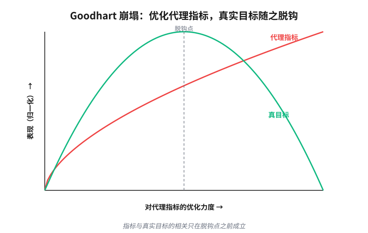

# 第 8 章　看不见自己的组织

> **论点**：大型组织或国家无法直接观察自己的知识与活动，这些知识与活动分散各处、部分隐藏，有时还被人刻意掩盖。于是组织转而抓住看得见的代理指标（代理替换的 Goodhart 崩塌在这里最为触目），再用审计（留痕）与冗余来补足。

## 一个看不清自己的庞然大物

讲放出去的智能体时，我们碰到过委托代理（principal-agent）难题。现在把它的尺度放大。委托方不再是一个人，而是一整个组织、一个国家；受托去行动的，是散落在各处的成千上万的人。于是出现了一个新的、近乎荒诞的局面：这个庞然大物看不清自己。

它想知道自己有多少人、种着什么、谁在做什么、做得好不好，可这些知识不在任何一个它能直接读取的地方。本章要问的是：当需要验证的对象，是组织自身那些分散的、隐藏的、还会主动躲闪的知识时，组织怎么办。这里的不可验证，把前面几种处境叠在了一起：部分可观测（partial observability，知识分散在边缘），再加上对抗（被观察的人会反过来操纵被观察的东西）。

## 分布的知识

哈耶克 1945 年那篇《知识在社会中的运用》<a href="#ref-1">1</a>把问题挑明了：一个社会赖以运转的知识，从来不集中在任何一处，而是分散在无数个体手里。这是关于特定时间、特定地点的局部知识（local knowledge），往往还说不清、道不明。哪台机器今天有点小毛病，哪个客户眼看就要流失，哪条小路雨后会塌，掌握这些知识的人常常自己都没意识到它算「知识」，更没办法把它打包上交给中心。波兰尼把这一层叫作默会维度（tacit dimension）<a href="#ref-2">2</a>：我们知道的，远多于我们说得出的。

这意味着，组织面对的不只是「信息暂时还没收上来」。哪怕每个人都忠诚配合，那些局部的、默会的知识在汇集的过程中也会蒸发。中心想要的那张「组织全貌」，原则上无法被如实地装进任何一个能验证它的容器。这是部分可观测在社会尺度上的版本，而且有一道更硬的底线：这些知识生来就是局部的，无法被汇集到任何一处。

## 清晰性的冲动

看不清，就设法让它变得可以看清。斯科特 1998 年的《国家的视角》<a href="#ref-3">3</a>给这种冲动起了一个准确的名字：清晰性（legibility）。国家要在社会上行动，得先把社会改造成它读得懂的样子。它丈量土地，绘制地籍图；给原本只有小名、绰号或随父名的人强加固定的姓氏；统一度量衡；推行标准化的科学营林。这些都不是中性的记录工作，而是在重塑现实，好让现实能填进表格。哈金的《驯服偶然》<a href="#ref-32">32</a>、德罗西埃的《大数字的政治》<a href="#ref-31">31</a>、鲍克与斯塔尔的《分类及其后果》<a href="#ref-30">30</a>，合起来就是一部「把社会变得可数」的历史。

清晰性的危险在于，地图必然简化，而组织一旦只照着地图行动，被地图抹掉的东西就会反噬。斯科特最有力的案例是科学营林（scientific forestry）。为了让森林「可读、可算、可收税」，普鲁士人把杂乱的天然林改造成整齐划一、便于清点的单一树种人工林。头一代长势喜人；到了第二代，土壤耗竭，虫害蔓延，森林成片死亡，德语里甚至为此造出了一个词：Waldsterben，森林之死。地图越干净，被它抹掉的那些维系系统运转的局部知识，就越是致命。组织这样做，是在为自己制造它缺少的可观测性，代价则是亲手削平了让它得以运转的复杂性。

## 代理指标与 Goodhart 崩塌

清晰性的冲动，最常见的结果就是指标。真正在意的东西（健康、学习、生产力、公共福祉）无法直接观测，于是组织一把抓住它看得见的代理指标（proxy）：KPI、GDP、考试分数、论文引用数、急诊等待时长。

这就是我们在第 7 章见过的代理替换。但它在这里以相反的方式失效，而这个对照是本书的一条主线。数学家的代理忠实却不更易：等价改写确实等价，可解题并没有因此变得更容易。组织的代理恰好反过来，更易却不忠实：指标当然好测，可指标一旦被当成目标，它与真目标之间的对应就会断裂。

这种断裂有许多名字。古德哈特 1975 年<a href="#ref-4">4</a>指出：一旦一个指标被当作政策目标，它作为指标的可靠性就会瓦解。坎贝尔 1979 年<a href="#ref-6">6</a>说的是同一件事的社会版本。早在 1956 年，里奇韦就编目整理过「绩效度量的失能后果」<a href="#ref-7">7</a>；克尔 1975 年那篇《奖励 A 却指望 B 的蠢事》<a href="#ref-8">8</a>，把它写成了管理学的常识。斯特拉森给了它最精炼的一句话<a href="#ref-5">5</a>：当一个度量变成目标，它就不再是个好度量。

更深的一层是反应性（reactivity）。埃斯佩兰与索德尔 2007 年<a href="#ref-12">12</a>指出，公开的排名不是在描述世界，而是在重造世界：被排名的大学会照着排名的算法改变自己，于是指标所「测量」的，变成了它自己催生出来的行为。贝文与胡德<a href="#ref-11">11</a>记录了英国医疗系统里针对指标的博弈；史密斯 1995 年<a href="#ref-10">10</a>分析了公开发布绩效数据如何招来一连串始料未及的后果；默顿 1936 年那篇关于「有目的社会行动的非预期后果」的文章<a href="#ref-9">9</a>，则是这一切的总源头。

这类崩塌在现实里屡见不鲜，代价有时惊人。为了冲「交叉销售」的账户指标，富国银行的员工在客户不知情的情况下私开了大量虚假账户。2016 年事发时，估计约有两百万个（后经复查升至约三百五十万个）。银行被罚一亿八千五百万美元，五千多名员工遭到解雇。那个被供起来的数字，反倒摧毁了它本该衡量的客户关系。更早还有一则寓言般的案例，发生在殖民时期的德里。当局为了灭蛇，悬赏收购眼镜蛇的尸体，市民索性养起蛇来领赏；赏金一停，这些蛇被尽数放生，蛇患反而比从前更重。「眼镜蛇效应」（cobra effect）由此得名。

为什么代理指标一定会被扭曲？委托代理理论给出了严格的解释。霍尔姆斯特伦 1979 年的信息性原理<a href="#ref-14">14</a>（informativeness principle）说：报酬应当挂靠在对「努力」有信息量的信号上。可一旦努力是多维的，而你只测得到其中几维，麻烦就来了。霍尔姆斯特伦与米尔格罗姆 1991 年的多任务分析<a href="#ref-15">15</a>（multitask principal-agent）说得很明白：一个人要同时兼顾可测与不可测的任务时，越是重奖可测的那部分，他就越会把努力从不可测的部分挪到可测的部分。设真目标为 $G$，可观测的代理指标为 $P$，两者在现状下是相关的。问题在于，这种相关是行为的产物，不是客观规律。一旦以 $P$ 作为施压的目标，

$$\arg\max_{a} P(a)\ \quad\text{vs.}\quad\ \arg\max_{a} G(a),$$

理性的代理人就会去找那些抬高 $P$、却无助于甚至有损 $G$ 的行动，这种相关就被优化的压力碾碎了。教师为考试而教，医院调度病人以压低某一项等待时长，研究者把一篇论文切成可以计数的最小发表单元，都是同一个机制。

<figure class="uvw-viz" data-static="f08-goodhart-curve" role="group" aria-label="Goodhart 崩塌交互图">

  

    <svg viewBox="0 0 640 380" preserveAspectRatio="xMidYMid meet" aria-hidden="true">
      <g class="uvw-axes" fill="none" stroke="currentColor" stroke-width="1.2" opacity="0.35">
        <line x1="70" y1="330" x2="610" y2="330"></line>
        <line x1="70" y1="40" x2="70" y2="330"></line>
      </g>
      <path class="uvw-proxy" fill="none" stroke-width="2.6"></path>
      <path class="uvw-true" fill="none" stroke-width="2.6"></path>
      <line class="uvw-cursor" y1="40" y2="330" stroke="currentColor" stroke-width="1.2" stroke-dasharray="4 4" opacity="0.55"></line>
      <circle class="uvw-dot-proxy" r="5"></circle>
      <circle class="uvw-dot-true" r="5"></circle>
      <text class="uvw-xlab" x="340" y="366" text-anchor="middle">优化压力（越往右，越使劲优化代理）→</text>
    </svg>
  

  

    <label>优化压力
      <input class="uvw-slider" type="range" min="0" max="100" value="30" step="1">
    </label>
    

      代理指标 <b class="uvw-v-proxy">–</b>
      真实目标 <b class="uvw-v-true">–</b>
      缺口 <b class="uvw-v-gap">–</b>
    

    

  

</figure>

## 用审计与冗余补足

代理指标单靠自己会塌，于是组织补上另外两招，这两招在本书里也反复出现。

留痕与审计。复式记账是人类最古老的审计链之一。索尔在《账簿与权力》<a href="#ref-22">22</a>里论证，记出可核查账目的能力，与一个个国家的兴衰直接相关：算得清自己的，才能持久。现代的财务审计、独立稽核，都是把「事前防不住舞弊」换成「事后查得出舞弊」。但这一招有它自己的病。鲍尔 1997 年的《审计社会》<a href="#ref-20">20</a>（audit society）一语点破：当验证变成一种仪式，组织生产出来的不过是「一切尽在掌握」的表象，而不是实际的掌握。肖尔与赖特笔下的「审计文化」<a href="#ref-17">17</a>（audit culture），奥尼尔在 2002 年里斯讲座中对「信任」<a href="#ref-21">21</a>的反思，讲的都是同一种异化：为了能被问责，机构把大量精力耗在制造可供检查的痕迹上，真正的工作反被挤到一边。

冗余与共识。兰道 1969 年那篇被低估的文章<a href="#ref-16">16</a>为「重复与重叠」正名：在一个零件都不完全可靠的系统里，冗余（redundancy）不是浪费，而是可靠性的来源；几个互相独立的核查，比单一的权威更难被同时骗过。这一招成立有一个前提，就是独立，下一部会反复强调这一点：如果几个核查来自同一个源头，相关的失效就会一举击穿冗余最核心的承诺。

## 接下来：第二部的收束

四个现场到此看完了。控制台前的人、放出去的智能体、撞墙的数学家、看不见自己的组织，它们面对的不可验证来源迥然不同：藏在心里的偏好，开放世界里的未来行为，原则上不可判定的命题，分散而又会躲闪的知识。可它们拿起的，是同一小套东西。

最该并排摆出来的，是代理替换两种相反的失效方式。数学家栽在「忠实却不更易」上，组织栽在「更易却不忠实」上。第 7 章那张 2×2 表的两端，现在都有了血肉。它们不是两招，而是同一招的两个失效方向。一个好代理必须同时避开这两端，既忠实又更易，这罕见到几乎就是全部的手艺。第 11 章会正式把这两端对接起来。委托代理的那副骨架，也从第 6 章的一段代码，长成了这里的一个国家。

第二部到此，把这些招数嵌在各个现场里、彼此缠绕地演示了一遍。它们零零散散，换着名字，混在各自的行话里。第三部要做的，是把每一招从它生长的领域里拔出来，洗干净，单独命名，一次覆盖所有现场。那张对照表，是这本书最主要的贡献。

---

## 参考文献

> 落足点：① 历史上科学家的判断　② 理论上被研究过的东西　③ 科学如何进展　④ 如何在无法验证的世界里生活。本节经网络逐条核实。

1. F. A. Hayek (1945).「The Use of Knowledge in Society」.《American Economic Review》, 35(4), 519-530. [②④]
   哈耶克论证，社会运转所依赖的知识从不集中于一处，而是分散在无数个体手中，是关乎特定时间、特定地点的局部知识，无法被任何中心如实汇集。这篇文章是本章「分布的知识」一节的直接出发点，也奠定了「组织看不清自己」这一困境的认识论底色。
2. M. Polanyi (1966).《The Tacit Dimension》. Doubleday. [②]
   波兰尼提出知识的默会维度，其名言是「我们知道的，远多于我们说得出的」。本书用它来说明，分散在边缘的局部知识中有相当一部分根本无法被言说和上交，这是组织难以验证自身的更硬的一层底。
3. J. C. Scott (1998).《Seeing Like a State: How Certain Schemes to Improve the Human Condition Have Failed》. Yale University Press. [②④]
   斯科特提出「清晰性」这一概念：国家为了在社会上行动，会用地籍图、固定姓氏、统一度量衡等手段把社会改造成自己读得懂的样子，而这种简化往往抹掉维系系统运转的局部知识，导致科学营林那样的失败。本章「清晰性的冲动」一节正建基于此，它是理解组织为何要亲手削平复杂性的核心读物。
4. C. A. E. Goodhart (1975).「Problems of Monetary Management: The U.K. Experience」.《Papers in Monetary Economics》, Vol. I. Reserve Bank of Australia. [②]
   古德哈特原本谈的是货币政策，却给出了后来被普遍引用的洞见：一旦某个统计规律被当作政策调控的目标，它原有的规律性就会瓦解。这就是本章「代理指标与 Goodhart 崩塌」一节的命名来源，是理解代理被优化压力碾碎的起点。
5. M. Strathern (1997).「Improving Ratings: Audit in the British University System」.《European Review》, 5(3), 305-321. [②④]
   斯特拉森借英国大学审计的经验，给古德哈特定律留下了最精炼的一句通俗表述：当一个度量变成目标，它就不再是个好度量。本章直接引用了这句话，它也是把抽象的代理崩塌讲给读者听的最佳一句话。
6. D. T. Campbell (1979).「Assessing the Impact of Planned Social Change」.《Evaluation and Program Planning》, 2(1), 67-90. [②④]
   坎贝尔从社会科学评估的角度提出了与古德哈特同构的「坎贝尔定律」：一个量化的社会指标越是被用于社会决策，它就越容易遭受腐蚀压力，也越会扭曲它本要监测的社会过程。本章用它佐证代理崩塌并非经济学独有，而是跨学科反复被发现的同一现象。
7. V. F. Ridgway (1956).「Dysfunctional Consequences of Performance Measurements」.《Administrative Science Quarterly》, 1(2), 240-247. [②④]
   里奇韦很早就系统编目了绩效度量的失能后果，区分了单一度量、复合度量和多重度量各自带来的扭曲。本章用它说明，针对指标的博弈与扭曲是一个被发现得相当早的老问题，而非晚近才有的管理学新词。
8. S. Kerr (1975).「On the Folly of Rewarding A, While Hoping for B」.《Academy of Management Journal》, 18(4), 769-783. [②④]
   克尔列举了大量现实例子，说明组织常常奖励一种行为，却指望得到另一种它没有奖励的行为，结果自然事与愿违。这篇文章把代理与激励的错配写成了管理学的常识，是本章「奖励 A 却指望 B」这一机制的经典出处。
9. R. K. Merton (1936).「The Unanticipated Consequences of Purposive Social Action」.《American Sociological Review》, 1(6), 894-904. [②④]
   默顿系统分析了有目的的社会行动为何总会带来未曾预料的后果，并梳理了无知、误判、价值偏好等成因。本章把它视为指标博弈、清晰性反噬等一系列「始料未及」现象的总源头。
10. P. Smith (1995).「On the Unintended Consequences of Publishing Performance Data in the Public Sector」.《International Journal of Public Administration》, 18(2-3), 277-310. [②④]
   史密斯分类梳理了公共部门公开发布绩效数据所招致的一连串非预期后果，如隧道视野、近视、目标错位、衡量固化、博弈等。本章用它把笼统的「指标被扭曲」拆成可辨认的若干种具体失效方式。
11. G. Bevan & C. Hood (2006).「What's Measured Is What Matters: Targets and Gaming in the English Public Health Care System」.《Public Administration》, 84(3), 517-538. [②④]
   贝文与胡德实证记录了英国国民医疗体系在「目标加恐吓」治理下针对指标的种种博弈，例如调度病人以压低等待时长这类应付指标却无助于真实健康的做法。本章以它为指标博弈在公共服务中如何具体发生的现场证据。
12. W. N. Espeland & M. Sauder (2007).「Rankings and Reactivity: How Public Measures Recreate Social Worlds」.《American Journal of Sociology》, 113(1), 1-40. [②④]
   埃斯佩兰与索德尔以法学院排名为例，提出「反应性」（reactivity）：公开的度量不只是描述世界，还会反过来重塑被度量者的行为，使指标最终测量的是它自己催生出来的反应。本章「更深的一层是反应性」一段正出自此，它把代理失效推进到指标制造现实这一层。
13. M. Sauder & W. N. Espeland (2009).「The Discipline of Rankings: Tight Coupling and Organizational Change」.《American Sociological Review》, 74(1), 63-82. [②④]
   这篇姊妹篇借福柯的规训概念分析排名如何嵌入组织：原本松散耦合的机构在排名压力下被迫紧密耦合，外部度量内化为日常的自我监控与组织变革。它与前一条互补，前者讲反应性机制，本条讲排名怎样改造组织的内部结构。
14. B. Holmström (1979).「Moral Hazard and Observability」.《The Bell Journal of Economics》, 10(1), 74-91. [②④]
   霍尔姆斯特伦提出信息性原理：在道德风险下，最优报酬契约应当挂靠在对代理人努力有信息量的全部信号上。本章用它为「代理为何注定被扭曲」给出严格的委托代理解释，并引出当努力多维而只测得几维时的麻烦。
15. B. Holmström & P. Milgrom (1991).「Multitask Principal-Agent Analyses: Incentive Contracts, Asset Ownership, and Job Design」.《The Journal of Law, Economics, and Organization》, 7(Special Issue), 24-52. [②]
   多任务委托代理模型说明，当一个人要同时兼顾可测与不可测的任务时，越是重奖可测的那部分，他就越会把努力从不可测的部分抽走。本章正是以此论证代理崩塌的机理：照可观测指标施压，会理性地诱使代理人放弃难以衡量却真正重要的工作。
16. M. Landau (1969).「Redundancy, Rationality, and the Problem of Duplication and Overlap」.《Public Administration Review》, 29(4), 346-358. [②④]
   兰道为常被斥为浪费的「重复与重叠」正名：在零件都不完全可靠的系统里，冗余正是可靠性的来源，多个相互独立的核查比单一权威更难被同时骗过。本章「用审计与冗余补足」一节直接采用这一论点，并强调它成立的前提是各核查彼此独立。
17. C. Shore & S. Wright (1999).「Audit Culture and Anthropology: Neo-Liberalism in British Higher Education」.《The Journal of the Royal Anthropological Institute》, 5(4), 557-575. [②④]
   肖尔与赖特以英国高等教育为例，提出「审计文化」：新自由主义治理下，问责与审计的逻辑渗透进学术机构，把同行变成被监控对象，重塑了人的自我治理方式。本章用它说明审计如何从工具异化为一种文化，让人耗在制造可供检查的痕迹上。
18. J. Z. Muller (2018).《The Tyranny of Metrics》. Princeton University Press. [④]
   穆勒面向一般读者，梳理了医疗、教育、警务、商业等领域过度依赖量化指标所带来的扭曲与代价，提出何时该用、何时不该用度量的判断。本书是把代理崩塌讲给实践者听的通俗综合之作，适合读者作为入门与对照。
19. T. M. Porter (1995).《Trust in Numbers: The Pursuit of Objectivity in Science and Public Life》. Princeton University Press. [②④]
   波特论证，对量化的依赖往往源于一种「机械的客观性」：在缺乏信任、需对外问责的处境下，数字被用作抑制个人判断、抵御质疑的工具。本书为理解组织为何执着于可读的数字提供了深层的社会学解释，与本章清晰性与审计两节互为背景。
20. M. Power (1997).《The Audit Society: Rituals of Verification》. Oxford University Press. [②④]
   鲍尔指出，当验证本身变成一套仪式，组织生产出来的往往是「一切尽在掌握」的表象，而非掌握本身，社会也随之为了可被审计而重塑自己。本章「用审计与冗余补足」一节借它点破审计这一招自带的病：留痕越多，真实工作越被挤到一边。
21. O. O'Neill (2002).《A Question of Trust: The BBC Reith Lectures 2002》. Cambridge University Press. [④]
   奥尼尔在这组里斯讲座中反思当代的问责文化：旨在重建信任的种种透明与审计措施，往往侵蚀了它们本想培育的信任，让人忙于应付检查而非把事做好。本章引它与「审计社会」并列，说明过度问责如何反噬。
22. J. Soll (2014).《The Reckoning: Financial Accountability and the Rise and Fall of Nations》. Basic Books. [①④]
   索尔以复式记账为线索，论证可核账目的能力与一个个国家的兴衰直接相关：算得清自己的，方能持久。本章用它支撑「留痕与审计」是人类最古老的验证链之一这一论断。
23. J. G. March & H. A. Simon (1958).《Organizations》. John Wiley & Sons. [②]
   马奇与西蒙奠定了现代组织理论：组织成员的理性是有限的，组织正是通过分工、程序与信息渠道来应对个体认知能力的局限。本书为「组织看不清自己」提供了基础框架，是理解信息如何在层级中流动与衰减的经典源头。
24. H. A. Simon (1947).《Administrative Behavior: A Study of Decision-Making Processes in Administrative Organization》. Macmillan. [②]
   西蒙提出有限理性，把组织理解为一套帮助成员在认知能力受限的条件下做出决策的结构。本书是理解组织为何必须依赖简化、惯例与代理来运转的源头，为本章组织自我认知的局限奠定了理论底盘。
25. R. M. Cyert & J. G. March (1963).《A Behavioral Theory of the Firm》. Prentice-Hall. [②]
   赛尔特与马奇提出企业的行为理论，强调组织决策受标准操作程序、有限搜索与各方目标协商支配，而非纯粹的最优化。本书有助于理解组织内部目标的多元与张力，是本章把组织看作有限理性主体的重要支撑。
26. O. E. Williamson (1975).《Markets and Hierarchies: Analysis and Antitrust Implications》. Free Press. [②]
   威廉森从交易成本出发，解释了为何有些活动由市场协调、有些则被纳入科层组织：有限理性与机会主义使得某些交易在层级内部完成更有效率。本书为组织为何要把分散的活动收编进自己内部、并因此承担起验证它们的难题提供了经济学解释。
27. K. J. Arrow (1974).《The Limits of Organization》. W. W. Norton. [②④]
   阿罗简练地探讨了组织作为应对信息匮乏与不确定性的手段，以及它在权威、责任与信任上遭遇的内在限度。本书指出信任是社会运转不可或缺却无法靠契约买到的润滑剂，与本章审计与冗余两节探讨的验证成本遥相呼应。
28. M. Lipsky (1980).《Street-Level Bureaucracy: Dilemmas of the Individual in Public Services》. Russell Sage Foundation. [②④]
   利普斯基指出，教师、警察、社工等一线官僚在资源不足的处境下行使大量自由裁量，他们的日常应对实际上塑造了公共政策的真实落地。本书是理解组织边缘的局部知识与裁量为何难以被中心观察和验证的重要参照。
29. J. Q. Wilson (1989).《Bureaucracy: What Government Agencies Do and Why They Do It》. Basic Books. [②④]
   威尔逊详细考察了政府机构的实际运作，区分了产出与结果均可观察与否的不同机构类型，并说明为何许多公共机构的真实成效难以衡量。本书为本章「组织看不见自己」提供了丰富的现实素材，尤其有助于理解为何代理指标在公共部门格外容易失真。
30. G. C. Bowker & S. L. Star (1999).《Sorting Things Out: Classification and Its Consequences》. MIT Press. [②④]
   鲍克与斯塔尔考察了分类系统如何无声地嵌入基础设施，又如何塑造它本想中立记录的现实，被分类抹平的差异往往带来实际后果。本章把它与哈金、德罗西埃并列，归入「把社会变得可数」这部历史，说明分类是清晰性工程的隐形一环。
31. A. Desrosières (1998).《The Politics of Large Numbers: A History of Statistical Reasoning》(trans. C. Naish). Harvard University Press. [②]
   德罗西埃梳理了统计推理的历史，说明统计范畴与国家管理同步成形，数字既是认识社会的工具，也是构造社会现实的政治行为。本章把它纳入「把社会变得可数」的谱系，揭示清晰性背后那套统计装置的来历。
32. I. Hacking (1990).《The Taming of Chance》. Cambridge University Press. [②]
   哈金考察了十九世纪统计与概率思想的兴起，论证大量收集人口数据如何「驯服偶然」，催生了「正常」与「常态」等支配现代治理的概念。本章引它说明，让社会变得可数本身就是一段重塑认知的历史，而非中性的记录。
