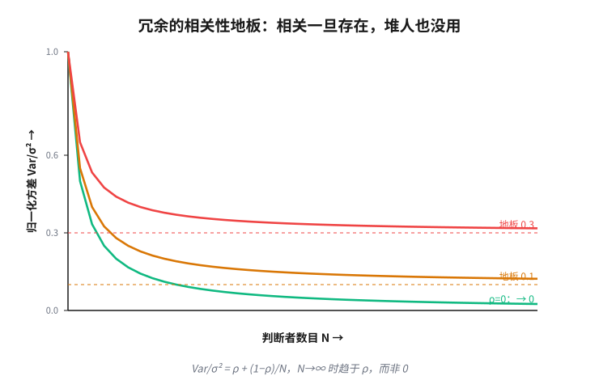

# 第 10 章　借来的判断

> **论点**：当你缺乏验证能力，就从外部引进。要么在回路里放一个可信的判断者（神谕，oracle），要么用许多互相独立的不可靠判断者，信任他们的一致（冗余，redundancy／共识，consensus）。

上一对招还在自己身上想办法，缩小未知。但有时你缺的不是信息，而是判断力本身，你压根没有能力对眼前这事下一个可靠的判决。这一对招的应对是：不在自己身上找了，去别处把判断借来。借法有两种，要么引进一个你信得过的判断者（神谕），要么集合许多互不信任的判断者，信任他们的一致（冗余）。

## 神谕入回路：引进一个判断者

第一招的纯形式：在你缺乏验证能力的那个决策点上，插入一个外部的判断者，由它来给出你给不出的判决。

最朴素的版本，是第 5 章那个人在回路（human-in-the-loop），是专家会诊，是疑难上交。但这一招最深刻的形态，藏在两个看似无关的地方。

一处是交互式定理证明（interactive theorem proving）。德布鲁因 1970 年的 AUTOMATH<a href="#ref-1">1</a>、爱丁堡 LCF（戈登、米尔纳、沃兹沃思 1979<a href="#ref-2">2</a>）、到今天的 Coq（贝尔托与卡斯特朗 2004<a href="#ref-3">3</a>），都是同一种分工：人提供那闪光的、机器给不出的证明思路（神谕），机器则一丝不苟地核对每一步（证书检查，certificate checking）。神谕负责「找」，机器负责「验」，正好咬合第 2 章那道不对称。

另一处更惊人，是复杂性理论里的交互式证明（interactive proof）。一个算力贫弱的验证者，面对一个强大却不可信的证明者，如何能问出一个它自己根本算不出的可靠答案？戈德瓦塞尔、米卡利与拉科夫 1989 年<a href="#ref-6">6</a>、巴拜 1985 年<a href="#ref-7">7</a>给出的答案是：靠反复盘问加随机挑战。验证者抛出它自己都无法预知的随机问题，证明者若在撒谎，迟早会在某个挑战上露馅。沙米尔 1992 年<a href="#ref-15">15</a>那个惊人的 $\mathrm{IP}=\mathrm{PSPACE}$ 表明，单靠这种「盘问一个不可信神谕」的方式，弱验证者能可靠地裁决极其庞大的一类问题；布卢姆与坎南 1995 年<a href="#ref-17">17</a>的「会检查自己工作的程序」、戈德瓦塞尔等人 2015 年<a href="#ref-19">19</a>「为凡人代理计算」，都是同一脉。这是「借来的判断」最纯的数学化：哪怕神谕不可信，只要你会聪明地盘问它，依然能榨出可靠。

统一的观念是：制造一种你单独不具备的可靠，靠引进一个外部判断者。它的标准败法也很直白：神谕本身不可靠或有偏。你引进的裁判，可能就是个错的裁判，而「谁来验证神谕」这个问题，会把你带进一段退无可退的回归。

## 冗余：从许多不可靠里合成可靠

第二招换了个方向：不引进一个可信的，而是召集许多不可信的，信任他们的一致。

它的理论根基有两块奠基石。冯·诺依曼 1956 年<a href="#ref-4">4</a>证明，可以用本身会出错的元件，通过堆叠冗余组装出任意可靠的计算。孔多塞 1785 年<a href="#ref-5">5</a>的陪审团定理（Condorcet's jury theorem）给出了它的算术：若每个判断者都略好于瞎猜（正确率 $p>\tfrac12$），且彼此独立，那么多数票正确的概率会随人数趋于必然，

$$P_N\to 1\quad(N\to\infty).$$

这一招的跨域形态铺得极开。分布式系统里，它是拜占庭容错（Byzantine fault tolerance）：皮斯、肖斯塔克与兰波特 1980 年<a href="#ref-8">8</a>、兰波特等人 1982 年<a href="#ref-9">9</a>的拜占庭将军问题（Byzantine generals problem），要在部分节点可能作恶（对抗）的情况下达成共识，经典门槛是节点数 $n\ge 3f+1$ 才能容忍 $f$ 个叛徒，卡斯特罗与利斯科夫 1999 年<a href="#ref-11">11</a>的 PBFT 把它做进了实用系统（费舍尔、林奇与帕特森 1985 年<a href="#ref-10">10</a>的不可能性定理则划出了它的边界）。机器学习里，它是集成（ensemble）：汉森与萨拉蒙 1990 年<a href="#ref-20">20</a>、迪特里希 2000 年<a href="#ref-22">22</a>的集成方法、布雷曼 2001 年<a href="#ref-23">23</a>的随机森林（random forest），用一群弱模型投票，胜过单个强模型。群体里，它是「群体的智慧」（wisdom of crowds）（索罗维基 2004<a href="#ref-25">25</a>）。1906 年高尔顿在一场乡村集市上记录了约八百位村民对一头公牛体重的独立竞猜，没有一个人猜准，可全体估计的平均值是 1197 磅，而牛的真实重量是 1198 磅，整个群体合起来几乎分毫不差。洪与佩奇 2004 年<a href="#ref-24">24</a>甚至证明，在合适条件下，多样的普通解题者群体能胜过一群高手。科学里，它是同行评审与重复实验（第 3 章）；工程里，它是 RAID 与法定人数；医疗里，它是第二诊疗意见。

但这一招有一个关键前提必须用整节强调：独立。冗余只在失败去相关时才成立。把许多估计平均，方差才随人数下降，

$$\mathrm{Var}(\bar X)=\frac{\sigma^2}{N};$$

可一旦这些判断之间有正相关 $\rho$，方差就不再趋于零，而是卡在一个地板上，

$$\mathrm{Var}(\bar X)=\rho\,\sigma^2+\frac{(1-\rho)\,\sigma^2}{N}\ \xrightarrow{N\to\infty}\ \rho\,\sigma^2.$$

相关把冗余的全部价值一笔勾销。你堆再多判断者，也跨不过这道由相关性设下的地板。这不是空谈：奈特与莱韦森 1986 年<a href="#ref-13">13</a>那个著名实验，让许多程序员独立地为同一规格编写程序，本指望它们的错误互不相干，结果发现他们栽在同样的地方，因为人类面对同一个难点会犯同样的错（埃克哈特与李 1985 年<a href="#ref-12">12</a>早有理论预言）。群体思维（groupthink）、同源的有缺陷训练数据、共模故障（common-mode failure），都是这道地板的现身。这就是冗余的标准败法：以为独立，其实相关。

## 两招的合流，与一段跨章的呼应

把两招并看：一个引进单一而昂贵的神谕，一个合成众多而廉价的独立判断，借的都是你单独不具备的判断力。它们共用的杠杆，是为自己补上缺失的验证能力；它们的败法也两两相对，单一神谕可能错，众多判断可能暗中相关。

数学里有一段插曲，恰好把这一对招、连同上一章的证书全串了起来。阿佩尔与哈肯 1977 年<a href="#ref-26">26</a>的四色定理（four color theorem）证明，因为依赖计算机的穷举而饱受争议，那等于要数学界去信任一个神谕。后来贡蒂耶 2008 年<a href="#ref-27">27</a>用机器可核对的形式证明（formal proof）重做了它，黑尔斯团队<a href="#ref-28">28</a>对开普勒猜想也如法炮制：把「信任神谕」转化成了「核对证书」。麦肯齐<a href="#ref-29">29</a>在《机械化证明》里追踪的，正是这种信任如何在人、机器与社会过程之间转移；德米洛等人<a href="#ref-14">14</a>那句「证明是一种社会过程」，说到底就是把数学的可信安放在人类判断的冗余之上。

不过要看清一件事：到这里为止，前两对招，压缩未知与借来判断，都还在追求同一样东西，对象的真。它们仍想知道这事到底对不对。下一对招做了一件更彻底的事：它不再索求那个真。

---

## 参考文献

> 落足点：① 历史上科学家的判断　② 理论上被研究过的东西　③ 科学如何进展　④ 如何在无法验证的世界里生活。本节经网络逐条核实。

1. N. G. de Bruijn (1970). 「The mathematical language AUTOMATH, its usage, and some of its extensions」. 收入《Symposium on Automatic Demonstration》. Springer (Lecture Notes in Mathematics 125), pp. 29-61. [②]
   德布鲁因介绍了 AUTOMATH，史上最早能让整篇数学被机器逐步核对的形式语言之一，由人写出证明、机器验证其无误。它是本章「神谕入回路」最早的工程化样本：人提供思路，机器只负责一丝不苟地检查，读者可由此看清「找」与「验」分工的源头。
2. M. Gordon, R. Milner, C. Wadsworth (1979).《Edinburgh LCF: A Mechanized Logic of Computation》. Springer (Lecture Notes in Computer Science 78). [②]
   这本书提出了 LCF 这套交互式证明系统，其设计影响深远：用一个受信任的小内核担保每一步推理的可靠，证明策略再多也无法绕过它。它为本章关于「证书检查」的论述提供了经典范式，读者可看到「可信核对者」如何被收缩成一个尽量小、尽量可靠的部件。
3. Y. Bertot, P. Castéran (2004).《Interactive Theorem Proving and Program Development. Coq'Art: The Calculus of Inductive Constructions》. Springer (Texts in Theoretical Computer Science, EATCS Series). [②]
   这是 Coq 证明助手的权威教程，系统讲解如何在归纳构造演算之上交互地构造并机器核对证明。它把前两条所代表的传统带到当代实践，是本章后文四色定理、开普勒猜想等形式化工作的工具基础，想动手理解「人给思路、机器验每步」的读者可由此入门。
4. J. von Neumann (1956). 「Probabilistic Logics and the Synthesis of Reliable Organisms from Unreliable Components」. 收入 C. E. Shannon, J. McCarthy 编《Automata Studies》(Annals of Mathematics Studies 34). Princeton University Press, pp. 43-98. [②]
   冯·诺依曼在此证明，可以用本身会出错的元件，通过堆叠冗余与多数表决，组装出任意逼近可靠的计算。这是本章「冗余」一招的奠基石之一，为「从许多不可靠里合成可靠」提供了最早的严格论证，读者应读其对冗余如何压低错误率的核心思路。
5. Marquis de Condorcet (1785).《Essai sur l'application de l'analyse à la probabilité des décisions rendues à la pluralité des voix》. Imprimerie Royale, Paris. [②④]
   孔多塞在这部关于投票的著作里给出了著名的陪审团定理：若每个判断者都略优于瞎猜且彼此独立，多数票正确的概率会随人数增长趋于必然。它为本章冗余一招提供了算术骨架，也预埋了它的命门，读者应留意定理对「独立」这一前提的依赖。
6. S. Goldwasser, S. Micali, C. Rackoff (1989). 「The Knowledge Complexity of Interactive Proof Systems」. SIAM Journal on Computing, 18(1), pp. 186-208. [②]
   这篇论文开创了交互式证明与零知识证明的理论框架：一个算力有限的验证者，靠反复盘问加随机挑战，能从一个不可信的证明者那里榨出可靠的判决。它是本章「盘问不可信神谕」最纯的数学源头，读者应读它如何用随机性逼出诚实。
7. L. Babai (1985). 「Trading Group Theory for Randomness」. 收入《Proceedings of the 17th Annual ACM Symposium on Theory of Computing (STOC)》, pp. 421-429. [②]
   巴拜在此独立提出了 Arthur-Merlin 这类带随机性的交互式证明，与上一条几乎同时奠定了同一片理论疆域。它强化了本章的核心观念：随机挑战是弱验证者制服强而不可信证明者的关键武器，读者可与上一条对照阅读其互补的视角。
8. M. Pease, R. Shostak, L. Lamport (1980). 「Reaching Agreement in the Presence of Faults」. Journal of the ACM, 27(2), pp. 228-234. [②]
   这篇论文最早严格刻画了在部分节点可能任意作恶时如何达成共识，给出了著名门槛：要容忍 $f$ 个叛徒，节点数须满足 $n\ge 3f+1$。它是本章冗余一招在分布式系统里的对抗性版本之源头，读者应读这个门槛背后的不可能性论证。
9. L. Lamport, R. Shostak, M. Pease (1982). 「The Byzantine Generals Problem」. ACM Transactions on Programming Languages and Systems, 4(3), pp. 382-401. [②]
   这篇论文用「拜占庭将军」这个著名比喻把上一条的结果讲成了一则寓言，从此「拜占庭容错」成为对抗性共识的通用名字。它是本章用许多互不信任的判断者求一致这一思路的标志性文本，读者可读它如何把抽象门槛包装成直觉清晰的故事。
10. M. J. Fischer, N. A. Lynch, M. S. Paterson (1985). 「Impossibility of Distributed Consensus with One Faulty Process」. Journal of the ACM, 32(2), pp. 374-382. [②]
   这篇著名的 FLP 不可能性定理证明，在完全异步的系统里，哪怕只有一个进程可能崩溃，也不存在保证终止的确定性共识算法。它为本章冗余一招划出了边界，读者应读它如何说明共识并非无条件可得，从而理解后续实用系统为何要靠额外假设来绕开它。
11. M. Castro, B. Liskov (1999). 「Practical Byzantine Fault Tolerance」. 收入《Proceedings of the 3rd USENIX Symposium on Operating Systems Design and Implementation (OSDI)》, pp. 173-186. [②]
   这篇论文提出的 PBFT 算法，第一次把拜占庭容错从理论做成在真实异步网络里跑得动、性能可接受的系统。它是本章冗余一招从纸面落到工程的关键一步，读者可读它如何在保住 $n\ge 3f+1$ 门槛的同时把开销压到实用范围，也理解后世区块链共识的直接前身。
12. D. E. Eckhardt, L. D. Lee (1985). 「A Theoretical Basis for the Analysis of Multiversion Software Subject to Coincident Errors」. IEEE Transactions on Software Engineering, SE-11(12), pp. 1511-1517. [②]
   这篇论文从理论上指出，多版本软件即便由不同人独立开发，其错误也未必独立：面对同一处难点，不同版本会倾向于一起出错，使冗余的收益远低于独立假设的预期。它为本章「相关性地板」给出了早于实验的理论预言，读者应读它如何刻画共因错误。
13. J. C. Knight, N. G. Leveson (1986). 「An Experimental Evaluation of the Assumption of Independence in Multiversion Programming」. IEEE Transactions on Software Engineering, SE-12(1), pp. 96-109. [②]
   这是那个著名的实验：让许多程序员独立地照同一规格编写程序，本指望错误互不相干，结果发现他们在相同的难点上一起栽倒，独立假设被经验否定。它为上一条的理论预言提供了实证，是本章「以为独立、其实相关」这一败法最有说服力的例证。
14. R. A. De Millo, R. J. Lipton, A. J. Perlis (1979). 「Social Processes and Proofs of Theorems and Programs」. Communications of the ACM, 22(5), pp. 271-280. [③④]
   这篇有名又有争议的论文主张，数学证明之所以可信，靠的不是形式推导的机械正确，而是数学共同体反复检验、传播、采信的社会过程，并据此质疑程序形式验证的前景。它支撑本章的观点：可信归根结底安放在人类判断的冗余之上，读者应读它对「证明是社会过程」的论证。
15. A. Shamir (1992). 「IP = PSPACE」. Journal of the ACM, 39(4), pp. 869-877. [②]
   沙米尔证明了交互式证明的威力之惊人：单靠盘问一个不可信证明者，弱验证者能可靠裁决整个 PSPACE 这一极庞大的问题类，即 $\mathrm{IP}=\mathrm{PSPACE}$。它是本章「借来的判断」最有力的数学注脚，读者应读它如何界定「会聪明盘问神谕」所能达到的上限。
16. C. Lund, L. Fortnow, H. Karloff, N. Nisan (1992). 「Algebraic Methods for Interactive Proof Systems」. Journal of the ACM, 39(4), pp. 859-868. [②]
   这篇论文引入了把布尔公式算术化、再用多项式做检查的代数方法，正是它的技术铺垫直接通向了上一条 $\mathrm{IP}=\mathrm{PSPACE}$ 的证明。它对本章的意义在于揭示「聪明盘问」的具体机理：把验证问题转译成可随机抽查的代数恒等式，读者可读这套手法。
17. M. Blum, S. Kannan (1995). 「Designing Programs That Check Their Work」. Journal of the ACM, 42(1), pp. 269-291. [②]
   这篇论文提出了「程序检查器」的思想：让程序在给出结果时附带一个独立、廉价的核对程序，验证本次输出是否正确，而无需信任程序本身。它把交互式证明的精神带到日常计算，对本章而言，是「不信任产出者、只核对其产出」这一思路的范本，读者应读其检查器的构造。
18. S. Arora, C. Lund, R. Motwani, M. Sudan, M. Szegedy (1998). 「Proof Verification and the Hardness of Approximation Problems」. Journal of the ACM, 45(3), pp. 501-555. [②]
   这是著名的 PCP 定理的核心论文之一：任何证明都能改写成一种特殊格式，使验证者只需随机抽查其中常数个比特，就能以高置信度判断其真伪。它把「抽查就够」推到极致，对本章是「弱验证者如何高效核对庞大证明」的理论顶点，读者应读其概率可检证明的惊人结论。
19. S. Goldwasser, Y. T. Kalai, G. N. Rothblum (2015). 「Delegating Computation: Interactive Proofs for Muggles」. Journal of the ACM, 62(4), Article 27. [②④]
   这篇论文让交互式证明真正服务于「凡人」：一个算力有限的用户把计算外包给强大但不可信的服务器，再用远小于自己重算的代价核对结果是否正确。它是本章思想走向云计算时代的落点，读者应读它如何把「为弱者代理计算并可验证」做成现实可行的协议。
20. L. K. Hansen, P. Salamon (1990). 「Neural Network Ensembles」. IEEE Transactions on Pattern Analysis and Machine Intelligence, 12(10), pp. 993-1001. [②]
   这篇论文较早地表明，把多个独立训练的神经网络组合起来投票，其整体准确率可显著高于任何单个网络。它是本章冗余一招在机器学习里的开端，读者应读它如何把「多数表决降低错误」从逻辑电路搬到学习模型，并再次落到对成员误差去相关的依赖。
21. A. Krogh, J. Vedelsby (1995). 「Neural Network Ensembles, Cross Validation, and Active Learning」. 收入《Advances in Neural Information Processing Systems 7》. MIT Press, pp. 231-238. [②]
   这篇论文给出了集成误差的经典分解：集成的整体误差等于成员的平均误差减去成员之间的分歧度。它为本章「相关性地板」提供了机器学习版的精确公式，读者应读它如何用数学说明，成员越是多样、越是各错各的，集成才越值钱。
22. T. G. Dietterich (2000). 「Ensemble Methods in Machine Learning」. 收入《Multiple Classifier Systems (MCS 2000)》. Springer (Lecture Notes in Computer Science 1857), pp. 1-15. [②]
   这是一篇影响广泛的综述，梳理了集成方法为何有效，并从统计、计算与表示三个角度给出解释。它是读者纵览本章冗余一招在机器学习里全貌的便捷入口，把分散的投票、装袋、提升等手法收拢在一个框架下理解。
23. L. Breiman (2001). 「Random Forests」. Machine Learning, 45(1), pp. 5-32. [②]
   布雷曼提出的随机森林，靠对样本与特征的双重随机化来培育一群彼此去相关的决策树，再投票合成强大而稳健的预测器。它是冗余一招最成功的实战范例之一，对本章的意义在于：它的全部威力恰恰来自刻意制造的独立性，读者可读它如何主动压低成员间的相关。
24. L. Hong, S. E. Page (2004). 「Groups of Diverse Problem Solvers Can Outperform Groups of High-Ability Problem Solvers」. Proceedings of the National Academy of Sciences, 101(46), pp. 16385-16389. [②③④]
   洪与佩奇借一个形式化模型论证：在合适条件下，由多样的普通解题者组成的群体，能胜过一群同质的高手，因为多样性带来的视角差异本身就是一种资源。它把本章「独立与多样才是冗余之本」的直觉推广到人类群体，读者应读其「多样性胜过能力」的论点与边界。
25. J. Surowiecki (2004).《The Wisdom of Crowds: Why the Many Are Smarter Than the Few and How Collective Wisdom Shapes Business, Economies, Societies, and Nations》. Doubleday. [③④]
   索罗维基这本广为流传的书论证：在多样、独立、分散且有恰当聚合机制的条件下，群体的集体判断往往胜过专家个人，他也反复强调一旦丧失独立、陷入趋同，群体就会变蠢。它把本章冗余一招带到日常与社会层面，读者应读它对「群体智慧成立的前提」的反复申明。
26. K. Appel, W. Haken (1977). 「Every Planar Map Is Four Colorable. Part I: Discharging」. Illinois Journal of Mathematics, 21(3), pp. 429-490. [①③]
   这是四色定理的证明，史上第一个本质上依赖计算机穷举大量情形的重大数学证明，也因此引发关于「能否信任一个人手无法逐一复核的机器结论」的长久争论。它对本章而言，是「信任神谕」与其代价的标志性案例，读者应读这场争论如何逼出对机器可核对证书的需求。
27. G. Gonthier (2008). 「Formal Proof: The Four-Color Theorem」. Notices of the American Mathematical Society, 55(11), pp. 1382-1393. [②③]
   贡蒂耶用 Coq 把四色定理重做成一份完全形式化、可被机器逐步核对的证明，从而把上一条那种「请信任计算机」的处境，转化为「核对一份证书」。它对本章是关键的对照点，读者应读它如何示范：把不可信的神谕产出，降格为可独立验证的证书，争议便随之消解。
28. T. Hales 等 (2017). 「A Formal Proof of the Kepler Conjecture」. Forum of Mathematics, Pi, 5, 文章号 e2. [②③]
   黑尔斯团队历经多年，用形式化证明系统把饱受争议的开普勒猜想证明彻底机器核对了一遍，了结了同行评审都难以完全担保的疑虑。它与上一条同属一个脉络，对本章的意义在于再次印证：当证明大到人力难核时，把信任从神谕转移到可核对的证书，是恢复确信的出路。
29. D. MacKenzie (2001).《Mechanizing Proof: Computing, Risk, and Trust》. MIT Press. [①③④]
   麦肯齐这部社会学史著作追踪了计算机证明与形式验证的兴起，考察「证明」与「确信」如何在数学家、机器与社会过程之间被反复定义与转移。它为本章提供了贯穿性的视角，把神谕、证书、冗余都安放进一个关于信任如何被建立与让渡的更大叙事，读者应读它对「机械化证明改变了我们信任什么」的考察。
