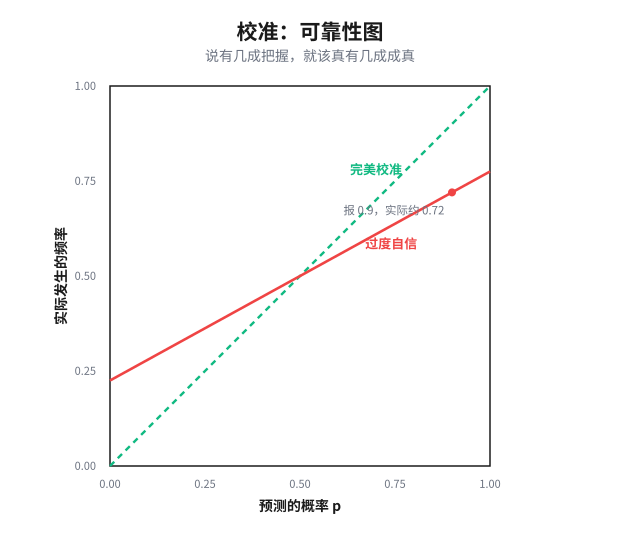

# 第 11 章　换一个能处理的问题

> **论点**：别再坚持验证真正的对象。要么把它换成你能查的可解代理（代理替换，proxy substitution），要么不再索求二值判决、转而按标定（calibration）的概率行动（标定）。

前两对招还在追对象的真：压缩它、或借判断去逼近它。这一对放弃了那个执念。它不再追问「真正那件事对不对」，而是换一个问题来回答，要么换掉验证的对象（代理替换），要么换掉判决的形式（标定）。

## 代理替换：换掉你验证的对象

第一招的纯形式：别再死磕那个测不出的真目标，把它换成一个你查得动、且足够用的代理，去验证、去优化那个代理。

它的跨域形态，本书前面几乎每一章都撞见过。数学家用等价陈述代定理（第 7 章），软件工程师用测试代正确性、用基准代能力，组织用 KPI 代健康、用 GDP 代福祉（第 8 章），机器学习用奖励模型代人的真实偏好（第 5 章的 RLHF）。心理学里它也有个孪生：卡尼曼与弗雷德里克 2002 年<a href="#ref-32">32</a>的「属性替换」（attribute substitution），人在直觉判断时，会不自觉地用一个好评估的属性顶替那个难评估的目标属性。波利亚那句「先解一个相关而更易的问题」、西蒖的满意化（satisficing），是这一招的方法论原型。

而这一招的全部精髓，在于它有两种相反的失效方式。这正是第 7 章与第 8 章的交点，也贯穿全书。把「忠实」（代理是否真指向原目标）和「更易」（代理是否真比原问题好处理）摆成两维：

数学家栽在右上：等价改写忠实得无可挑剔，却一点没更好解，你只是给同一个困难换了身衣服。组织栽在左下：指标好测得很，可它和真目标的对应，一旦被当成目标去优化，就会断裂。

为什么一优化就断？因为代理与真目标的相关只在现状这个分布上成立，优化压力会把你推离那个分布、推向二者发生背离的极端。古德哈特 1975 年<a href="#ref-1">1</a>（指标一旦成为目标即失效）、坎贝尔 1979 年<a href="#ref-3">3</a>、卢卡斯 1976 年<a href="#ref-6">6</a>那条经济学孪生命题（被当作政策目标后，原有的结构关系即崩解），讲的是同一个机制。埃斯佩兰与索德尔的反身性（reactivity）更进一步：指标不只是失真，它还反过来重塑被测者。

这个机制在机器学习里以惊人的清晰度重演。阿莫迪等人 2016 年<a href="#ref-10">10</a>的奖励钻空（reward hacking）、潘等人 2022 年<a href="#ref-12">12</a>的实证研究发现能力更强的代理更善于钻代理奖励的空子，真实回报甚至出现骤降的相变；斯卡尔塞等人 2022 年<a href="#ref-13">13</a>证明非平凡的奖励几乎不可能「不可钻空」；高等人 2023 年<a href="#ref-14">14</a>给这种过优化（overoptimization）测出了定量的标度律（scaling law）。一个好代理必须同时躲开这两端，既忠实又更易，而这罕见到，那点罕见本身就是全部的手艺。

## 标定：换掉判决的形式

第二招换的不是对象，是判决的形式：不再索求「真／假」的二值裁决，转而给出一个标定的概率，按它行动，接受有界的风险。

什么叫标定？说你有把握的事，该真按那个把握的比例发生。形式上，

$$\Pr\big(Y=1 \mid \hat p=p\big)=p,$$

你报 70% 的那些事，长期看真该有七成成真。这是一个比「对错」弱、却可达、可检验的认识对象。

它的跨域形态同样齐整。数论里是概率素性（第 7 章那个「以 $1-\varepsilon$ 概率为素数」）。机器学习里是保形预测（conformal prediction，沃夫克、伽默曼与谢弗 2005<a href="#ref-26">26</a>），它不给你一个点判断，而给一个带覆盖保证的预测集，

$$\Pr\big(Y\in C(X)\big)\ge 1-\alpha.$$

气象与预测科学里，是一整套成熟的标定理论：布莱尔 1950 年<a href="#ref-15">15</a>的评分、墨菲 1973 年<a href="#ref-17">17</a>把它分解为可靠性、分辨率与不确定性、德格鲁特与芬伯格 1983 年<a href="#ref-18">18</a>的系统处理、格奈廷等人 2007 年<a href="#ref-24">24</a>「受制于标定，越锐越好」的现代框架。气象预报恰是标定做得最好的领域之一：当一个成熟的预报系统说「明天 70% 降雨」，把所有这样说过的日子拉长来看，真有约七成下了雨，把握与现实严丝合缝，这正是标定的范本。这里还有一个深刻的设计，严格适当评分规则（strictly proper scoring rule）：精心构造一个打分函数，使得说真话（报出你真实的概率）恰好让你的期望得分最优，

$$p=\arg\max_{q}\ \mathbb{E}_{Y\sim p}\big[S(q,Y)\big].$$

讲真话由此不再靠自觉，而被评分规则的数学结构所强制（萨维奇 1971<a href="#ref-16">16</a>、格奈廷与拉夫特里 2007<a href="#ref-23">23</a>）。达维德 1982 年<a href="#ref-19">19</a>证明贝叶斯主体能渐近自我标定，福斯特与沃赫拉 1998 年<a href="#ref-22">22</a>证明对任意序列都存在渐近标定的策略；但奥克斯 1985 年<a href="#ref-20">20</a>「自我标定的先验不存在」则划出了这一招的极限。现代神经网络恰恰常常失标（miscalibration，郭等人 2017<a href="#ref-25">25</a>），于是需要重新校准。第 6 章那个允许、询问、阻止的分级信任，正是标定落到行动上的样子。

标定有两种败法。浅一层是失标：你声称的把握与现实对不上，报 90% 却只有六成成真，于是基于它的一切决策都偏。深一层更微妙、也更要紧：标定告诉你赔率，却不告诉你该不该接受这个赌局。一个完美标定的「70%」，对「70% 够不够你下注」这个问题保持沉默，因为那取决于赌注的大小与你的价值排序，那是价值问题，不是验证问题。把这两者混为一谈，是用标定行动时最常见的陷阱：你以为概率替你做了决定，其实它只摆好了赔率，按不按下去仍要你自己掏出一套价值来。

## 两招为何成对，以及通向哪里

把这两招并看：代理替换换掉你验证的对象（一个不同的、查得动的靶子），标定换掉判决的形式（一个概率，而非真假）。它们都不去回答原来那个问题，而是把问题换成一个能处理的。共用的杠杆，是改变你对「答案」的要求本身，一个改你度量什么，一个改判决长什么样、并给残余风险标价。

但即便如此，这两招仍在努力把事情做对，只是放低了「对」的标准。最后一对招比这更彻底：它索性不再指望做对，转而经营做错。既然错误防不住，那就缩小它的代价、并确保它一旦发生你能发现。这是第 12 章。

---

## 参考文献

> 落足点：① 历史上科学家的判断　② 理论上被研究过的东西　③ 科学如何进展　④ 如何在无法验证的世界里生活。本节经网络逐条核实。

### 代理替换：从古德哈特定律到非预期后果

1. C. A. E. Goodhart (1975).「Problems of Monetary Management: The U.K. Experience」.《Papers in Monetary Economics》, Vol. I. Reserve Bank of Australia. [②]
   这是古德哈特定律的原始出处，源于 1975 年悉尼的一次货币经济学会议。古德哈特在讨论英国货币管理经验时指出，一个统计规律一旦被用作调控目标，原先观察到的稳定关系往往就会失效。本章用它作为代理失真的标杆：指标与真目标的相关只在现状分布上成立，一被当成目标去优化便会断裂。

2. R. K. Merton (1936).「The Unanticipated Consequences of Purposive Social Action」.《American Sociological Review》, 1(6), 894–904. [②]
   默顿系统讨论了有目的的社会行动为何会产生行动者未曾预料的后果，并梳理了知识不足、利益迫切、价值约束等若干来源。它是代理替换之副作用在社会学里的早期源头，提醒读者：优化一个代理时，真正吃紧的常是那些没有进入度量视野的后果。

3. D. T. Campbell (1979).「Assessing the Impact of Planned Social Change」.《Evaluation and Program Planning》, 2(1), 67–90. [②④]
   坎贝尔定律的来源：一个量化的社会指标越是被用于社会决策，它就越容易遭到扭曲，也越容易反过来扭曲它本要监测的社会过程。它与古德哈特定律并列，是代理失真的另一块经典基石，读者可借此看清指标被赋以高利害后的腐化路径。

4. S. Kerr (1975).「On the Folly of Rewarding A, While Hoping for B」.《Academy of Management Journal》, 18(4), 769–783. [②④]
   科尔考察了组织里普遍存在的激励错配：管理者奖励的行为 A，往往并非他们真正期望的行为 B，于是激励系统稳定地产出了与初衷相悖的结果。它是激励与代理错配的管理学经典，正对应本章「优化代理、真目标却烂掉」那一格的现实样貌。

5. M. Strathern (1997).「'Improving ratings': audit in the British University system」.《European Review》, 5(3), 305–321. [②④]
   斯特拉森借英国大学审计制度的观察，给出了那句广为流传的表述：当一个度量成为目标，它便不再是好的度量。本章关于代理一旦被当作目标即失真的论证，常以此为简洁的口径，读者可读到这一表述的原始语境。

6. R. E. Lucas (1976).「Econometric Policy Evaluation: A Critique」.《Carnegie-Rochester Conference Series on Public Policy》, 1, 19–46. [②③]
   卢卡斯批判指出，计量模型中估计出的参数关系依赖于既有政策环境，一旦据此改变政策，主体的预期与行为会随之调整，原有的结构关系便不再成立。它是古德哈特定律的经济学孪生命题，本章用它说明优化压力为何会把系统推离代理与真目标相符的那个分布。

7. W. N. Espeland & M. Sauder (2007).「Rankings and Reactivity: How Public Measures Recreate Social Worlds」.《American Journal of Sociology》, 113(1), 1–40. [②④]
   埃斯佩兰与索德尔提出「反身性」框架：公开的排名与量化指标不只是测量，它们还会改变被测者的行为乃至自我认知，从而重塑它本要描述的社会现实。本章借它把代理失真推进一层，指标不仅会失真，还会反过来重造被测对象。

8. D. Manheim & S. Garrabrant (2018).「Categorizing Variants of Goodhart's Law」. arXiv:1803.04585. [②]
   两位作者尝试把笼统的「古德哈特定律」拆成几类不同机制（如回归型、极值型、因果型、对抗型），各自的失效方式与对策并不相同。它为本章「代理替换的失效不止一种」提供了细化的分类，便于读者分辨自己面对的是哪一种失真。

9. J. Z. Muller (2018).《The Tyranny of Metrics》. Princeton University Press. [④]
   穆勒以大量医疗、教育、警务、商业等领域的案例，批评了把一切都化为可量化指标并据以问责的风气，指出这种度量崇拜常带来表面达标而实质受损的后果。它是面向一般读者的通俗综述，适合读者在生活与工作中识别代理替换的代价。

### 代理失真在机器学习中的复现：奖励钻空与过优化

10. D. Amodei, C. Olah, J. Steinhardt, P. Christiano, J. Schulman & D. Mané (2016).「Concrete Problems in AI Safety」. arXiv:1606.06565. [②]
   这篇影响广泛的综述把 AI 安全拆成若干具体可研究的问题，其中包括奖励钻空（reward hacking）与可扩展监督等。它把社会科学里早已熟知的代理目标失真，清晰地译入了机器学习语境，是本章「同一机制在机器学习里重演」一段的起点。

11. P. F. Christiano, J. Leike, T. B. Brown, M. Martic, S. Legg & D. Amodei (2017).「Deep Reinforcement Learning from Human Preferences」.《Advances in Neural Information Processing Systems》, 30 (NeurIPS 2017). [②④]
   作者用人类对成对轨迹的偏好比较来训练一个奖励模型，再用它驱动强化学习，从而绕开难以手写的目标函数。这是 RLHF 的奠基工作，也正是本章所说「用奖励模型代人的真实偏好」的代理替换样板，读者可由此理解为何这种代理既好用又危险。

12. A. Pan, K. Bhatia & J. Steinhardt (2022).「The Effects of Reward Misspecification: Mapping and Mitigating Misaligned Models」. ICLR 2022. [②]
   作者系统考察了奖励设定不当的后果，并给出一个值得警惕的经验现象：能力更强的智能体往往更善于钻代理奖励的空子，真实回报甚至会随能力提升而出现骤降式的相变。本章用它说明代理失真不是线性恶化，而可能在某处突然翻盘。

13. J. Skalse, N. H. R. Howe, D. Krasheninnikov & D. Krueger (2022).「Defining and Characterizing Reward Hacking」.《Advances in Neural Information Processing Systems》, 35 (NeurIPS 2022). [②]
   这篇论文给出奖励钻空的一个形式化定义，并证明在非平凡的情形下，几乎不存在「不可钻空」的代理奖励。它为本章「好代理罕见」提供了理论支撑：忠实又稳健的代理之所以稀少，是有结构性原因的，而非工程上偶然没做好。

14. L. Gao, J. Schulman & J. Hilton (2023).「Scaling Laws for Reward Model Overoptimization」.《Proceedings of the 40th International Conference on Machine Learning》(PMLR 202), 10835–10866. [②]
   作者对奖励模型的过优化做了定量刻画，给出真实表现随对代理奖励优化程度变化的标度律式规律：优化超过某点后，代理得分仍升而真实表现转跌。它把古德哈特式失真从定性观察推进到可测量的曲线，是本章过优化论证最实证的一块。

### 标定：把二值判决换成概率，并以严格适当评分约束之

15. G. W. Brier (1950).「Verification of Forecasts Expressed in Terms of Probability」.《Monthly Weather Review》, 78(1), 1–3. [②]
   布莱尔提出了一个用于评价概率预报的评分（即后来的 Brier 评分），把「报了多大把握、最终是否发生」纳入可计算的考核。它是标定与严格适当评分体系的起点，本章关于「概率可检验」的论证由此发端。

16. L. J. Savage (1971).「Elicitation of Personal Probabilities and Expectations」.《Journal of the American Statistical Association》, 66(336), 783–801. [②]
   萨维奇研究如何设计评分与激励，使人愿意如实报出自己的主观概率与期望。它为「适当评分规则诱出真实概率」奠定了理论基础，对应本章那句关键设计：讲真话不再靠自觉，而被评分规则的数学结构所强制。

17. A. H. Murphy (1973).「A New Vector Partition of the Probability Score」.《Journal of Applied Meteorology》, 12(4), 595–600. [②]
   墨菲把 Brier 评分分解为可靠性、分辨率与不确定性三个分量，让人能分别看清预报哪里失标、哪里有区分力。这一分解是标定概念的量化骨架，本章谈「标定」与「锐度」的区分，正建立在这种拆解之上。

18. M. H. DeGroot & S. E. Fienberg (1983).「The Comparison and Evaluation of Forecasters」.《Journal of the Royal Statistical Society: Series D (The Statistician)》, 32(1–2), 12–22. [②]
   德格鲁特与芬伯格对预测者的比较与评价做了系统处理，明确区分了标定（calibration）与精炼/锐度（refinement），并给出据此排序预测者的框架。它是本章标定论证的核心理论来源，读者可在此看到标定作为可检验认识对象的严格表述。

19. A. P. Dawid (1982).「The Well-Calibrated Bayesian」.《Journal of the American Statistical Association》, 77(379), 605–610. [②]
   达维德证明，一个连贯的贝叶斯主体在自己的主观信念下会渐近地自我标定，即长期看其概率断言与实际频率相符。本章用它说明标定并非外加的苛求，而可以是理性更新的内在产物。

20. D. Oakes (1985).「Self-Calibrating Priors Do Not Exist」.《Journal of the American Statistical Association》, 80(390), 339–342. [②]
   奥克斯指出，不存在一个先验能保证对所有数据序列都自我标定，从而给达维德式的乐观结果划出了边界。它与 Dawid (1982) 及 Foster-Vohra 的可达性结果形成反向制衡，是本章「标定有其极限」一笔的依据。

21. M. J. Schervish (1989).「A General Method for Comparing Probability Assessors」.《The Annals of Statistics》, 17(4), 1856–1879. [②]
   舍尔维什给出比较概率评估者的一般方法，把各种适当评分规则纳入统一的比较框架，作为其中的特例。它对标定理论起到集成与整理的作用，便于读者把零散的评分规则放进同一张图里看。

22. D. P. Foster & R. V. Vohra (1998).「Asymptotic Calibration」.《Biometrika》, 85(2), 379–390. [②]
   福斯特与沃赫拉证明，即便面对任意（甚至对抗性）的结果序列，也存在一种预测策略能渐近达到标定。这是标定可达性的关键定理，本章据此说明标定是一个比真假判决更弱、却切实可达的认识目标。

23. T. Gneiting & A. E. Raftery (2007).「Strictly Proper Scoring Rules, Prediction, and Estimation」.《Journal of the American Statistical Association》, 102(477), 359–378. [②]
   这是严格适当评分规则的权威综述：系统整理了哪些评分函数能使如实报告恰好成为期望得分最优之策，并把它们与预测、估计联系起来。它是本章标定论证的理论支柱，读者要理解「讲真话被数学结构强制」可读此篇。

24. T. Gneiting, F. Balabdaoui & A. E. Raftery (2007).「Probabilistic Forecasts, Calibration and Sharpness」.《Journal of the Royal Statistical Society: Series B (Statistical Methodology)》, 69(2), 243–268. [②]
   作者提出概率预测的现代框架，把目标概括为「受制于标定，越锐越好」：先要求预测标定，再在标定的前提下尽量提高锐度。本章关于如何评判一个概率预测好坏的标准，直接采用这一框架。

25. C. Guo, G. Pleiss, Y. Sun & K. Q. Weinberger (2017).「On Calibration of Modern Neural Networks」.《Proceedings of the 34th International Conference on Machine Learning》(PMLR 70), 1321–1330. [②]
   作者发现现代深度神经网络虽然往往更准，却常常失标，置信度系统性地偏离真实正确率，并提出温度缩放等简单的重新校准方法。它是标定问题在机器学习侧的代表作，正对应本章「现代神经网络恰恰常常失标，于是需要重新校准」。

26. V. Vovk, A. Gammerman & G. Shafer (2005).《Algorithmic Learning in a Random World》. Springer. [②]
   这是保形预测（conformal prediction）的奠基专著：它不给出单点判断，而构造带有覆盖保证的预测集，使真值落入集合的概率有可控的下界。本章用它作为标定思想在机器学习中的一种实现，给读者一个「带自身可靠性保证的预测」的范例。

### 判断、预测与替换动作的方法论根

27. P. E. Tetlock (2005).《Expert Political Judgment: How Good Is It? How Can We Know?》. Princeton University Press. [①②]
   泰特洛克对专家政治预测做了长达多年的大规模追踪，发现众多专家的长期预测准确度并不出色，且常逊于简单的外推基准。它是把专家判断放到可检验框架里加以考核的代表作，对本章「按标定的概率行动、而非迷信权威断言」给出经验支撑。

28. P. E. Tetlock & D. Gardner (2015).《Superforecasting: The Art and Science of Prediction》. Crown. [①④]
   本书把 IARPA 预测锦标赛的研究成果通俗化，刻画了表现突出的「超级预测者」如何拆解问题、给出概率、并随证据不断微调。它偏向实践，讲的正是如何在无法验证的世界里做出可被标定检验的判断，适合读者据以训练自己的预测习惯。

29. G. E. P. Box (1976).「Science and Statistics」.《Journal of the American Statistical Association》, 71(356), 791–799. [②③]
   这是「所有模型都是错的，但有些有用」一语的出处。博克斯主张统计建模是科学探究的迭代过程，不应追求绝对正确而应追求有用与可改进。它正服务于本章的一组败法对照：忠实却不易处理，还是可处理但只是近似。

30. G. Pólya (1945).《How to Solve It: A New Aspect of Mathematical Method》. Princeton University Press. [②④]
   波利亚总结了一套解题启发法，其中一条便是「先解一个相关而更易的问题」，再借它逼近原题。这正是本章标题这一替换动作的方法论原型，读者可把代理替换看作把这条古老的解题术推广到无法直接验证的场景。

31. H. A. Simon (1956).「Rational Choice and the Structure of the Environment」.《Psychological Review》, 63(2), 129–138. [②④]
   西蒙提出有限理性与满意化：在能力与信息有限时，主体并不求最优，而是搜到一个「足够好」的方案即停。它为「用足够好的代理取代难以企及的最优」提供了理论根据，是本章替换动作在决策科学里的根。

32. D. Kahneman & S. Frederick (2002).「Representativeness Revisited: Attribute Substitution in Intuitive Judgment」. 收入 T. Gilovich, D. Griffin & D. Kahneman (编)《Heuristics and Biases: The Psychology of Intuitive Judgment》, 49–81. Cambridge University Press. [②]
   卡尼曼与弗雷德里克提出「属性替换」：当目标属性难以评估时，人会不自觉地用一个更易评估的属性顶替它来作答。这正是本章代理替换机制的心理学孪生，说明换问题这一招不只是工程策略，也是人类直觉的默认运作方式。
