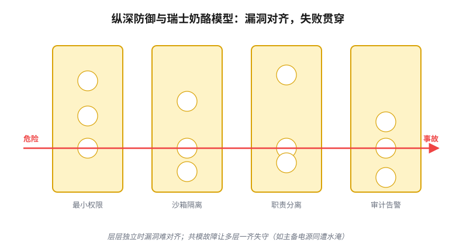

# 第 12 章　管住后果

> **论点**：既然错误无法杜绝，就转而管控它的后果：限制一个有错而又未经验证的对象所能造成的破坏（限损，事前），并确保一旦出错，必能被发现（留痕，事后）。

前三章的对策，无论把「对」的标准放得多低，终究仍在努力把事情做对。本章讨论的最后两种对策则承认无法保证做对，于是转而着眼于失败的后果。既然错误无法杜绝，就在事前缩小它所能造成的破坏（限损），并确保它一旦发生，事后能够被追查（留痕）。

## 限损：缩小爆炸半径

第一种对策的一般形式是：不再试图保证那个未经验证的对象不出错，而是在事前就把它出错时所能波及的范围严格限定下来。工程上把这一范围称为爆炸半径（blast radius）。

这一对策构成了计算机安全最深厚的根基。早在 1966 年，丹尼斯与范霍恩就提出了能力（capability）机制<a href="#ref-7">7</a>；1973 年，兰普森提出了围堵（confinement）问题<a href="#ref-2">2</a>；1975 年，萨尔策与施罗德提出了最小权限原则（principle of least privilege）<a href="#ref-1">1</a>；1976 年，丹宁又提出了信息流格（information flow lattice）<a href="#ref-5">5</a>。贝尔-拉帕杜拉<a href="#ref-3">3</a>与比巴<a href="#ref-4">4</a>的安全模型，同样属于这一脉络。这些工作的主旨是一致的：只赋予一个组件完成其本职工作所必需的最小能力，此外一概不予；如此，即便它被攻破或者出错，也无法造成大范围的破坏。沙箱（sandbox，戈德堡等人 1996）<a href="#ref-9">9</a>、职责分离与纵深防御，都是这一思想的具体形式。

在计算机安全之外，同样的思想以不同的名称出现。系统可靠性工程中的熔断器与隔板（尼加德的《Release It!》<a href="#ref-15">15</a>）、爆炸半径设计、金丝雀发布与错误预算（error budget，谷歌 SRE<a href="#ref-30">30</a>），金融中的头寸限额与止损，都是限损的不同形态；塔勒布所说的反脆弱（antifragility）<a href="#ref-17">17</a>，关注的也是如何为下行风险设定上限。

这些做法的共同思路，是把重心从「使它不出错」（这需要我们并不具备的验证能力）转向「使它即便出错也能承受」。纵深防御（defense in depth）为此提供了一个常见的量化直觉：如果 $k$ 层防护各自独立地以概率 $p$ 失守，那么全部同时失守的概率为

$$p^{k},$$

它随层数的增加呈指数下降。然而，这里必须立即补上第 10 章的警告：$p^k$ 只在各层的失效相互独立时才成立。倘若各层都受制于同一个弱点（同一个被绕过的内核，同一个管理员口令），相关性便会使纵深防御骤然退化为单层防护。2011 年的福岛核事故是这一道理的写照。电站原本具有多重冗余，除主电源之外，还配有备用柴油发电机，但一场海啸将它们一并淹没。本应相互独立的几道防线因同一个原因而同时失效，纵深防御也就形同虚设。

<figure class="uvw-viz" data-static="f12-defense-depth" role="group" aria-label="纵深防御与瑞士奶酪模型交互图">

  

    <svg viewBox="0 0 640 380" preserveAspectRatio="xMidYMid meet" aria-hidden="true">
      <text class="uvw-verdict" x="320" y="28" text-anchor="middle"></text>
      <g class="uvw-layers"></g>
      <line class="uvw-ray" stroke-width="3"></line>
      <circle class="uvw-ray-head" r="5"></circle>
      <text class="uvw-attacker">攻击</text>
    </svg>
  

  

    <label>攻击高度
      <input class="uvw-attack" type="range" min="0" max="100" value="50" step="1">
    </label>
    <label>层数
      <input class="uvw-layers-n" type="range" min="2" max="6" value="4" step="1">
      <b class="uvw-n">4</b>
    </label>
    <label class="uvw-check-l"><input class="uvw-correlate" type="checkbox"> 让漏洞对齐（共因失效）</label>
    <button class="uvw-rand" type="button">随机漏洞位置</button>
    

      结论：<b class="uvw-v-verdict">–</b>
    

    

  

</figure>

这一对策的标准失效方式正在于此：限损被绕过。沙箱可能出现逃逸，权限可能在不知不觉中蔓延；表面上层层设防，各层却共用着同一道暗门。另一种较少被提及的失效方式是防护过度：它连正常的功能也一并阻断，使用者只好绕开防护完成工作，安全措施反而名存实亡。

## 留痕：让错误事后现形

第二种对策的一般形式是：对于无法预防的错误，确保它一旦发生便必定被发现。换言之，把检查从事前移到事后。

这一对策最坚实的技术基础来自密码学。默克尔 1980 年提出的哈希树（Merkle tree）<a href="#ref-18">18</a>，以及哈伯与斯托尔奈塔 1991 年提出的链式时间戳<a href="#ref-19">19</a>，使一份记录一旦写下便无法被暗中篡改，任何改动都会在校验时暴露。后来的工作又从不同方面加固了这套做法：施奈尔与凯尔西 1998 年设计了在不可信机器上保护日志的方案<a href="#ref-20">20</a>，贝拉雷与迈纳 1999 年提出了前向安全签名（forward-secure signature）<a href="#ref-22">22</a>，克罗斯比与瓦拉赫 2009 年则给出了防篡改日志（tamper-evident log）<a href="#ref-23">23</a>。证书透明度（Certificate Transparency，RFC 6962）<a href="#ref-24">24</a>与中本聪 2008 年的比特币<a href="#ref-27">27</a>，本质上都是一本全球范围、只能追加、人人可验的审计账。要核对一条记录是否在这样一棵树中，代价只有 $O(\log n)$。这再一次得益于第 7 章所说的那种不对称：验证比构造便宜。

不过，这一对策的历史远比密码学悠久。复式记账（double-entry bookkeeping）便是人类最早的防篡改账本之一。索尔在《账簿与权力》<a href="#ref-29">29</a>中论证，一个国家能否算清自己的账目，与它的兴衰直接相关。现代的财务审计与独立稽核，延续的也是同一思路。在科学中，与之对应的是预注册（preregistration，诺塞克 2018）<a href="#ref-33">33</a>与可复现（呼应第 3 章讨论的可重复性危机）：研究者在看到数据之前就登记假说与方法，事后便无法随意移动靶子。

这些做法的共同思路，是放弃「事前阻止坏事」（这需要验证），转而保证「事后必能发现坏事」（这只需要一本忠实的账）。其益处有两层：其一，错误可以得到纠正；其二，由于人人知道作恶终将无所遁形，这本账也就具有威慑力。

留痕的标准失效方式也只有一种，却极为常见：错误被检测到了，却无人响应。无人阅读的审计日志，一概被忽略的告警，与不存在无异。2017 年的 Equifax 数据泄露是一个典型案例。一个已知漏洞迟迟未打补丁，入侵者在系统中潜伏了约七十六天才被察觉，约一亿四千七百万人的个人信息由此外泄。痕迹都留在日志之中，只是无人查看。只有检测而没有响应，检测便徒具形式。（另一个隐患是日志自身也可能遭到篡改，上文所述的密码学手段要防范的就是这一漏洞。）

## 八种对策的全貌：第三部结语

把最后这两种对策放在一起考察：限损在事前缩小失败的代价，留痕在事后保证失败会被发现。二者都不再试图使那个未经验证的对象变得正确，而是改变失败的形态：前者缩小爆炸半径，后者把检查移到事后。

至此，八种对策已全部论及。它们两两成对，共分四对：

- **压缩未知**（第 9 章）：证书／界、最优筛查。
- **借来的判断**（第 10 章）：神谕入回路、冗余／共识。
- **换一个能处理的问题**（第 11 章）：代理替换、校准。
- **管住后果**（第 12 章）：限损／围栏、留痕／可审计。

这就是那张对照表，也是全书最主要的贡献。在第二部考察的四个具体场景中，以及在科学中，这些对策以不同的术语反复出现，却始终不出这八种。依照第 4 章确立的原则，本书对每一种对策都尽可能说明了它的机制、它在各领域中的形态及其标准的失效方式，而不仅仅依据表面上的相似。

然而，一个尖锐的问题仍悬而未决：为什么是这八种对策，而不是别的？这份清单是我拼凑而成的，还是每一种对策都对应着某种更基本、无法回避的东西？如果它只是一份清单，本书至多是一部有用的分类手册；唯有背后确实存在某种结构，「收敛」才算得到了解释。第四部将追问这一问题：先尝试把八种对策安置在一个共同的骨架之上，再正面回答，这种收敛究竟是一条定律，还是一个很强的经验模式。

## 参考文献

> 落足点：① 历史上科学家的判断　② 理论上被研究过的东西　③ 科学如何进展　④ 如何在无法验证的世界里生活。本节经网络逐条核实。

1. J. Saltzer & M. Schroeder (1975).《The Protection of Information in Computer Systems》. Proceedings of the IEEE. doi:[10.1109/proc.1975.9939](https://doi.org/10.1109/proc.1975.9939) [②]
   这篇综述把保护机制的设计原则系统化，其中最小权限原则成为「限损」这一对策的源头：只给一个组件完成本职所必需的能力，其余一概不给。本章「缩小爆炸半径」的整个思路即由此发端，是理解为何要事前圈死失败范围的第一篇必读文献。
2. B. Lampson (1973).「A Note on the Confinement Problem」. Communications of the ACM. doi:[10.1145/362375.362389](https://doi.org/10.1145/362375.362389) [②]
   兰普森提出「围堵问题」：如何确保一个被调用的程序无法泄露或滥用它所接触的信息，包括隐蔽信道这类难堵的旁路。它给「把出错的东西关进笼子」立下了精确的问题陈述，正是本章限损这一对策要解决的核心。
3. D. Bell & L. LaPadula (1973).《Secure Computer Systems: Mathematical Foundations》. The MITRE Corporation. [链接](https://archive.org/details/DTIC_AD0770768) [②]
   贝尔-拉帕杜拉模型用形式化方式刻画机密性：信息只能由低密级流向同级或更高密级，著名的「不上读、不下写」规则即出于此。它示范了如何把「失败的波及范围」写成可证明的格结构，是安全模型理论化的奠基之作。
4. K. Biba (1977).《Integrity Considerations for Secure Computer Systems》. The MITRE Corporation. [Google Books](https://books.google.com/books?id=lAa4SgAACAAJ) [②]
   比巴模型是贝尔-拉帕杜拉的对偶，关注完整性而非机密性：信息只能由高可信向低可信流动，以防低可信数据污染关键组件。两者并看，说明同一套格论框架可以从两个方向限定失败的扩散。
5. D. Denning (1976).「A Lattice Model of Secure Information Flow」. Communications of the ACM. doi:[10.1145/360051.360056](https://doi.org/10.1145/360051.360056) [②]
   丹宁把信息流安全统一进一个格模型：为数据标上安全标签，要求流动只能沿格的偏序方向进行，从而在编译期或运行期静态地约束信息能去哪里。它为前面几种安全模型提供了共同的数学语言，是信息流控制的理论核心。
6. D. Clark & D. Wilson (1987).「A Comparison of Commercial and Military Computer Security Policies」. IEEE Symposium on Security and Privacy. doi:[10.1109/sp.1987.10001](https://doi.org/10.1109/sp.1987.10001) [②]
   克拉克与威尔逊指出商业场景更看重完整性而非军方式的机密性，并提出以良构事务和职责分离为核心的完整性模型。它把「限损」从军用密级扩展到商业账务等日常场景，说明限定失败范围的形态随领域而变。
7. J. Dennis & E. Van Horn (1966).「Programming Semantics for Multiprogrammed Computations」. Communications of the ACM. doi:[10.1145/365230.365252](https://doi.org/10.1145/365230.365252) [②]
   这篇早期论文提出了能力（capability）的概念：访问权以不可伪造的令牌形式直接附着在引用上，持有令牌才能操作对象。它是能力安全模型的源头，为「只给必需的最小能力」提供了机制层面的实现路径。
8. N. Provos, M. Friedl & P. Honeyman (2003).「Preventing Privilege Escalation」. 12th USENIX Security Symposium. [链接](https://www.usenix.org/conference/12th-usenix-security-symposium/preventing-privilege-escalation) [②]
   作者们讨论如何用权限分离把特权操作隔离到极小的、受信的代码段，使主体程序即便被攻破也只能在低权限下活动，OpenSSH 的特权分离是其代表实践。它把最小权限落到了真实系统的工程细节上。
9. I. Goldberg, D. Wagner, R. Thomas & E. Brewer (1996).「A Secure Environment for Untrusted Helper Applications」. 6th USENIX Security Symposium. [链接](https://www.usenix.org/conference/6th-usenix-security-symposium/secure-environment-untrusted-helper-applications) [②]
   这篇论文介绍 Janus，用系统调用拦截为不可信程序构造受限的运行环境，是用户态沙箱的早期范例。本章把沙箱列为限损这一对策的化身，此文正是沙箱思想的代表性出处。
10. C. Perrow (1984).《Normal Accidents: Living with High-Risk Technologies》. Basic Books. [Google Books](https://books.google.com/books?id=N3hRAAAAMAAJ) [②①]
   佩罗提出「正常事故」论：在高度复杂且紧密耦合的系统里，灾难性事故不是偶然而是结构性必然，无法靠加防护根除。它从反面支撑本章的立场：当错误防不胜防，重心就该移到经营后果而非妄图杜绝失败。
11. N. Leveson (2011).《Engineering a Safer World: Systems Thinking Applied to Safety》. MIT Press. doi:[10.7551/mitpress/8179.001.0001](https://doi.org/10.7551/mitpress/8179.001.0001) [②]
   莱韦森用系统论重构安全工程，提出 STAMP 模型，把事故看成控制结构失效而非单一部件故障，强调用约束去限定危险状态。它为「事前圈死失败范围」提供了系统层面的方法论。
12. J. Reason (1990).《Human Error》. Cambridge University Press. doi:[10.1017/cbo9781139062367](https://doi.org/10.1017/cbo9781139062367) [②]
   里森系统分析人因失误，提出著名的「瑞士奶酪模型」：每层防护都有漏洞，唯当多层漏洞偶然对齐时事故才贯穿而出。它正是本章纵深防御直觉的来源，也提醒各层漏洞一旦相关，多层就退化成单层。
13. E. Hollnagel, D. Woods & N. Leveson (2006).《Resilience Engineering: Concepts and Precepts》. Ashgate. [Google Books](https://books.google.com/books?id=0M3thf03JiYC) [②④]
   这本文集奠定「韧性工程」：系统的安全不在于消灭故障，而在于具备吸收扰动、在失败后仍维持运转和恢复的能力。它与本章主旨高度契合，把重心从「不出错」明确转向「出错也扛得住」。
14. A. Avizienis, J.-C. Laprie, B. Randell & C. Landwehr (2004).「Basic Concepts and Taxonomy of Dependable and Secure Computing」. IEEE Transactions on Dependable and Secure Computing. doi:[10.1109/tdsc.2004.2](https://doi.org/10.1109/tdsc.2004.2) [②]
   这篇被广泛引用的分类学厘清了故障、错误、失效的链条，以及容错、防错、查错等手段的关系。它为本章讨论的各种限损与留痕手段提供了一套公认的术语框架，适合作为概念校准的参考。
15. M. Nygard (2007).《Release It! Design and Deploy Production-Ready Software》. Pragmatic Bookshelf. [Google Books](https://books.google.com/books?id=gMlYEQAAQBAJ) [②④]
   尼加德把可靠性工程写成实战手册，提出熔断器、隔板、超时、舱壁隔离等稳定性模式，以阻止局部故障级联成全局崩溃。本章正文以它为爆炸半径设计的代表，是把限损思想用于生产系统的直接读物。
16. R. Anderson (2020).《Security Engineering: A Guide to Building Dependable Distributed Systems》（第三版）. Wiley. doi:[10.1002/9781119644682](https://doi.org/10.1002/9781119644682) [②④]
   安德森这本巨著横跨密码学、访问控制、经济激励到现实攻防，是安全工程的权威综合教材。本章涉及的最小权限、审计、防篡改等几乎所有主题都能在其中找到更完整的展开，适合作为通读底本。
17. N. N. Taleb (2012).《Antifragile: Things That Gain from Disorder》. Random House. [Google Books](https://books.google.com/books?id=5fqbz_qGi0AC) [④]
   塔勒布提出「反脆弱」：有些系统不只在波动中存活，还从波动中受益，关键在限死下行、保留上行。本章引它说明限损的极致姿态就是把损失封顶，是从风险经营角度理解「管住后果」的视角。
18. R. Merkle (1980).「Protocols for Public Key Cryptosystems」. IEEE Symposium on Security and Privacy. doi:[10.1109/sp.1980.10006](https://doi.org/10.1109/sp.1980.10006) [②]
   默克尔在此提出了用哈希树（默克尔树）做树状认证的思想：把大量数据归并成一个根哈希，任一项的真伪只需 $O(\log n)$ 的路径即可校验。它是本章「留痕」这一对策的技术基石，也是后来证书透明度与区块链的共同祖先。
19. S. Haber & W. S. Stornetta (1991).「How to Time-Stamp a Digital Document」. Journal of Cryptology. doi:[10.1007/bf00196791](https://doi.org/10.1007/bf00196791) [②]
   两位作者提出用哈希把文档时间戳串成链，使任何事后篡改都会破坏链的连续性而暴露。这是链式防篡改记录的开创性工作，直接启发了后来的区块链结构，是理解留痕为何「改不掉」的关键。
20. B. Schneier & J. Kelsey (1998).「Cryptographic Support for Secure Logs on Untrusted Machines」. 7th USENIX Security Symposium. [链接](https://www.usenix.org/conference/7th-usenix-security-symposium/cryptographic-support-secure-logs-untrusted-machines) [②]
   本文设计了在可能被攻陷的机器上保护日志的方案：即便攻击者事后取得控制权，也无法不被察觉地删改此前的记录。它把防篡改日志推进到不可信环境，是本章留痕这一对策的核心技术之一。
21. B. Schneier & J. Kelsey (1999).「Secure Audit Logs to Support Computer Forensics」. ACM Transactions on Information and System Security. doi:[10.1145/317087.317089](https://doi.org/10.1145/317087.317089) [②]
   这是上一篇工作的期刊版扩展，更完整地论述了支持取证的安全审计日志构造。它说明留痕不仅要忠实记录，还要在事后能经得起对抗性的核验，对应本章「让错误事后现形」的目标。
22. M. Bellare & S. Miner (1999).「A Forward-Secure Digital Signature Scheme」. CRYPTO '99. doi:[10.1007/3-540-48405-1\_28](https://doi.org/10.1007/3-540-48405-1_28) [②]
   贝拉雷与迈纳提出前向安全签名：密钥定期演进，即使当前密钥泄露，攻击者也无法伪造此前时段的签名。它为留痕提供了关键保障，使过去的记录在私钥失守后仍不可被冒名篡改。
23. S. Crosby & D. Wallach (2009).「Efficient Data Structures for Tamper-Evident Logging」. 18th USENIX Security Symposium. [链接](https://www.usenix.org/conference/usenixsecurity09/technical-sessions/presentation/efficient-data-structures-tamper-evident) [②]
   作者们设计了可高效追加与审计的防篡改日志结构，让验证者无需信任日志服务器即可确认记录的完整与一致。它把前述密码学手段整合成可落地的数据结构，是留痕这一对策走向工程化的代表作。
24. B. Laurie, A. Langley & E. Kasper (2013).《RFC 6962: Certificate Transparency》. IETF. doi:[10.17487/RFC6962](https://doi.org/10.17487/RFC6962) [②]
   证书透明度用公开、只能追加、可被任何人审计的默克尔日志记录所有签发的 TLS 证书，使误签或恶意证书无所遁形。它是本章「全球范围、人人可验的审计账」的现实样板，展示留痕如何规模化部署。
25. L. Lamport, R. Shostak & M. Pease (1982).「The Byzantine Generals Problem」. ACM Transactions on Programming Languages and Systems. doi:[10.1145/357172.357176](https://doi.org/10.1145/357172.357176) [②]
   这篇经典论文形式化了拜占庭容错问题：在部分节点可能任意作恶时，诚实节点如何就一个值达成一致，并给出了可容错节点数的理论界。它是公开可验账本所依赖的共识理论根基，被本章列入「理论上被研究过的东西」。
26. M. Castro & B. Liskov (1999).「Practical Byzantine Fault Tolerance」. 3rd USENIX Symposium on Operating Systems Design and Implementation（OSDI）. [链接](https://www.usenix.org/conference/osdi-99/practical-byzantine-fault-tolerance) [②]
   卡斯特罗与利斯科夫给出第一个在真实异步网络中实用的拜占庭容错算法 PBFT，把理论上的共识做到了可工程化的性能。它说明一本人人可验、容忍作恶节点的账本并非空想，为留痕的可信基础提供了实现支撑。
27. S. Nakamoto (2008).《Bitcoin: A Peer-to-Peer Electronic Cash System》. 白皮书. [链接](https://bitcoin.org/bitcoin.pdf) [②]
   中本聪的白皮书提出比特币：用工作量证明驱动一条去中心化、只能追加的区块链，让无需互信的各方就交易历史达成共识。本章视其本质为一本全球可验的审计账，是留痕思想在开放网络上的极端实现。
28. D. Weitzner, H. Abelson, T. Berners-Lee, J. Feigenbaum, J. Hendler & G. Sussman (2008).「Information Accountability」. Communications of the ACM. doi:[10.1145/1349026.1349043](https://doi.org/10.1145/1349026.1349043) [②④]
   作者们主张从「事前封锁访问」转向「事后问责」：允许信息流动，但要求用途可被审计、违规可被追溯并追究责任。这与本章把检查从事前挪到事后的「留痕」姿态完全同构，是该理念在隐私治理上的纲领性表述。
29. J. Soll (2014).《The Reckoning: Financial Accountability and the Rise and Fall of Nations》. Basic Books. [Google Books](https://books.google.com/books?id=pidWDgAAQBAJ) [①]
   索尔以财务史论证：一个政权能否算清并如实呈现自己的账目，与其兴衰直接相关，复式记账是其中关键的问责技术。它把留痕的脉络上溯到人类最早的防篡改账本，说明审计账的力量由来已久。
30. B. Beyer, C. Jones, J. Petoff & N. Murphy (2016).《Site Reliability Engineering: How Google Runs Production Systems》. O'Reilly. [Google Books](https://books.google.com/books?id=tYrPCwAAQBAJ) [④]
   这本书系统介绍谷歌的 SRE 实践，包括错误预算、金丝雀发布、监控告警与可控的故障演练。本章借其错误预算与金丝雀发布说明限损如何在大规模生产中制度化，是把「管住后果」工程化的现代范本。
31. J. Ioannidis (2005).「Why Most Published Research Findings Are False」. PLoS Medicine. doi:[10.1371/journal.pmed.0020124](https://doi.org/10.1371/journal.pmed.0020124) [③]
   约阿尼迪斯用统计建模论证：在低先验、小样本、多重比较与研究自由度过大的条件下，大量已发表的研究结论很可能为假阳性。这是一篇分析性论证而非实证复制研究，为本章提到的预注册与可复现给出了问题诊断。
32. Open Science Collaboration (2015).「Estimating the Reproducibility of Psychological Science」. Science. doi:[10.1126/science.aac4716](https://doi.org/10.1126/science.aac4716) [③]
   这是一项大规模实证：多组研究者尝试复制上百项心理学研究，结果相当一部分未能复现。它把约阿尼迪斯的理论担忧落成可见的数据，是「可重复性危机」的标志性证据，呼应本章对事后可验的重视。
33. B. Nosek, C. Ebersole, A. DeHaven & D. Mellor (2018).「The Preregistration Revolution」. PNAS. doi:[10.1073/pnas.1708274114](https://doi.org/10.1073/pnas.1708274114) [③]
   诺塞克等人倡导预注册：在看到数据之前就公开登记假说与分析方法，使探索性与验证性研究分离，事后无法移动靶子。它是科学领域的「留痕」实践，把检验从事前的信任挪到事后的核对，与本章主旨直接对应。
