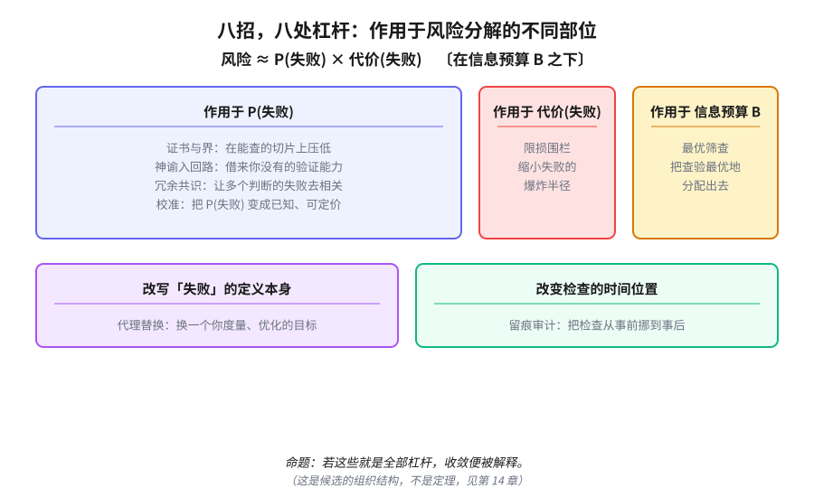

# 第 13 章　八根杠杆

> **论点**：八招不是随意的清单；每一招拉动风险与信息分解里一根不同的杠杆，这正是它们让人觉得「齐了」的原因。

第三部交出了那张对照表：八招，四对，在四个现场加科学里反复以不同行话出现。但一张清单再齐整，也只是清单。这一章要追问的是：为什么偏偏是这八招？是我凑出来的，还是它们各自卡在某个躲不开的位置上？如果是后者，收敛才算被解释，否则本书顶多是本好用的归类手册。

我要提出一个候选的解释。先把丑话说在前头：它是一个组织结构，不是一个证明。读完整章，请带着第 14 章那把怀疑的刀。

## 一个粗糙的分解

把「在不可验证下行动」剥到最简，你真正在管理的，是风险。借决策论（decision theory）的老话（瓦尔德、萨维奇、冯·诺依曼与摩根斯特恩），风险可以粗略地写成

$$\text{Risk}\ \approx\ \Pr(\text{fail})\ \times\ \text{Cost}(\text{fail}),$$

而这一切，是在一个信息预算 $B$ 之下进行的，你能用来削减不确定的查验、样本、算力、时间，都是有限的。

这个式子看着简单，关键在于：它右边能被你下手的地方，是可数的几处。你要么动「失败」的定义本身，要么动失败的概率，要么动你对那个概率的认知，要么动失败的代价，要么动这笔信息预算怎么花，要么动检查发生的时间。我的命题是：八招，恰好一招一个位置，再没有第九个空位可填。

## 八招，八个位置

把每一招对到它所拉动的那根杠杆：

| 招 | 它拉动的杠杆 | 在风险分解中的位置 |
| --- | --- | --- |
| 代理替换（proxy substitution） | 改变你度量、优化的目标 | 改写「失败」的定义本身 |
| 证书（certificate）与界 | 在一个切片上把不确定压到有保证的界内 | 在局部将 $\Pr(\text{fail})$ 压近零 |
| 神谕入回路 | 引进你单独不具备的验证能力 | 借外力降 $\Pr(\text{fail})$ |
| 冗余共识 | 让多个判断的失败去相关 | 降联合失败概率 $\Pr(\text{all\ fail})$ |
| 最优筛查 | 把信息预算花在边际收益最高处 | 分配 $B$，最大化对不确定的削减 |
| 标定（calibration） | 给残余风险定一个诚实的价 | 让 $\Pr(\text{fail})$ 变成已知、可据以下注 |
| 衰减围栏 | 缩小爆炸半径 | 降 $\text{Cost}(\text{fail})$ |
| 留痕审计 | 把检查从事前挪到事后 | 改检查的时间位置，把不可恢复的失败变可恢复 |

读这张表，那个「凑出来的清单」的感觉应当松动一些。八招不是八件随手收集的工具，它们分占了「$\Pr$、对 $\Pr$ 的认知、代价、预算分配、检查时点、目标定义」这几处，几乎是把那个分解式能下手的地方一一占满。命题于是可以这样下：若这些确实就是全部的杠杆，那这套招就是完整的，而收敛也就被解释了，任何有能力的主体，迟早都会重新发现它们，因为除此之外没有别的可拉。

## 为什么这能跨越基质

如果上面成立，它顺带解释了本书最初那个谜：为什么数学家、工程师、组织会不约而同。

马尔在研究视觉时区分过三个层次：计算层（computational level，要解决什么问题、受什么约束）、算法层（algorithmic level，用什么表示和过程）、实现层（implementational level，落在什么硬件上）。八招活在计算层。它们是「给定不可验证这个约束，逻辑上还能动哪几处」的答案，而这个答案不依赖你是碳基的数学家、硅基的程序，还是由人组成的官僚机构。基质（substrate）千差万别，计算层的约束却是同一个，于是应对收敛。西蒙的有限理性（bounded rationality）、他的「人工科学」（the sciences of the artificial），讲的正是这种由环境约束、而非由主体内部塑造的行为。

这里还得请出无免费午餐定理（no free lunch theorem，沃尔珀特与麦克里迪）。它说：在所有可能问题上平均，没有哪个方法优于另一个。这把刀两面都割。一面，它支持本书的克制，没有万能解，你必须借问题的具体结构来选杠杆，这正是为什么五副面孔要分开对待。另一面，它也警告：任何宣称「找到了统一钥匙」的人，包括我，都该收敛一点傲气。当你连失败概率都钉不住时，杠杆还会长出稳健版本，吉尔博亚与施迈德勒的极大极小期望效用（maxmin expected utility）、汉森与萨金特的稳健控制（robust control）、奈特式不确定性（Knightian uncertainty）下的决策，都是在 $\Pr$ 本身都模糊（ambiguity）时，仍要按最坏情形布防的招法。

## 一句必须放大的强声明

现在把丑话放大。

上面这套，是一个候选的组织结构，不是一个定理。那个风险分解是非形式的，我没有给出一个严格的主体与环境模型，再证明最优策略恰好是这八根杠杆。「这些就是全部的杠杆」是一句断言，不是一个已确立的结果。我没有证据说这张表是穷尽的，也无法排除它只是一个事后框架，一个足够灵活、能把许多套招都塞进去的叙事。表里某些归位（比如冗余既降联合失败、又像是一种特殊的筛查）甚至有重叠，这本身就说明这个分解还不够干净。

我把它放在这里，是因为它有组织力、有解释上的吸引力，而不是因为它被证明了。它够得上一个好猜想的标准：清晰、可反驳、能统起大量现象。但它还没够上定理。

那么，最后那个问题就躲不掉了：这种跨领域的收敛，到底是某种东西逼出来的一条定律，还是仅仅一个很强、却终究是经验的模式？下一章，正面、诚实地清算它。

---

## 参考文献

> 落足点：① 历史上科学家的判断　② 理论上被研究过的东西　③ 科学如何进展　④ 如何在无法验证的世界里生活。本节经网络逐条核实。

1. A. Wald (1950).《Statistical Decision Functions》. John Wiley & Sons. [②④]
   瓦尔德把统计推断重铸为一个对抗自然的决策问题：决策者要在风险（损失的期望）下选择策略，并以极小化最大风险的极大极小准则来对付未知的状态。这本书奠定了统计决策论，本章那个「风险约等于失败概率乘以代价」的粗糙分解，其学理根子正在此处。
2. A. Wald (1939). 「Contributions to the Theory of Statistical Estimation and Testing Hypotheses」.《The Annals of Mathematical Statistics》, 10(4), 299-326. [②]
   这是瓦尔德把估计与检验统一进损失函数框架的早期论文，先于他后来的专著，已引入风险函数与最不利先验的思路。它标记了「用决策语言谈统计」这一转向的起点，对理解本章为何从决策论借力很有价值。
3. J. von Neumann & O. Morgenstern (1944).《Theory of Games and Economic Behavior》. Princeton University Press. [②]
   冯·诺依曼与摩根斯特恩创立博弈论，并由一组公理推出期望效用定理：满足理性公理的偏好可由对效用的期望最大化来表示。这是「在不确定下下注」的规范基准，本章引它作为风险计算的源头之一。
4. L. J. Savage (1954).《The Foundations of Statistics》. John Wiley & Sons. [②④]
   萨维奇用一套关于行动偏好的公理，同时导出主观概率与效用，把贝叶斯决策论建在个人化概率之上。它是「主观概率加期望效用」这一现代框架的奠基之作，也是后文埃尔斯伯格悖论所要挑战的靶子。
5. F. H. Knight (1921).《Risk, Uncertainty and Profit》. Houghton Mifflin. [②]
   奈特区分了可量化的「风险」与无法赋予概率的「不确定性」，并主张企业利润正来自承担后者。这条区分是本章谈「连失败概率都钉不住」时的关键概念来源，奈特式不确定性贯穿后面一系列稳健决策文献。
6. J. M. Keynes (1921).《A Treatise on Probability》. Macmillan. [②]
   凯恩斯发展了一种逻辑解释下的概率观，把概率看作命题间的理性信念度，并强调许多概率既非数值化、也未必可比较。它为后来的非可加、不精确概率埋下伏笔，提醒读者概率本身的认知地位远比公式复杂。
7. F. P. Ramsey (1931). 「Truth and Probability」.《The Foundations of Mathematics and other Logical Essays》(R. B. Braithwaite 编). Kegan Paul, Trench, Trubner & Co., 156-198. [②]
   拉姆齐最早论证：一个人的信念度可由其下注行为操作性地测得，而避免被稳赚组合套利（荷兰赌）要求这些信念度服从概率公理。这是主观概率的开山之作，为本章「给残余风险定一个诚实的价」提供了哲学与操作上的依据。
8. B. de Finetti (1937). 「La prévision: ses lois logiques, ses sources subjectives」.《Annales de l'Institut Henri Poincaré》, 7(1), 1-68. [②]
   德·菲内蒂提出主观概率，并以荷兰赌论证与可交换性的表示定理给它撑腰，论证概率「只是」一致的个人信念度。它与拉姆齐共同构成贝叶斯主义的基石，是理解标定与诚实定价的必读源头。
9. F. J. Anscombe & R. J. Aumann (1963). 「A Definition of Subjective Probability」.《The Annals of Mathematical Statistics》, 34(1), 199-205. [②]
   两位作者借引入客观随机化装置（如轮盘彩票），给出一套比萨维奇更简洁的主观概率与效用公理化。这一框架后来成为模糊决策理论的标准舞台，本章引用的多篇模糊厌恶文献都在它上面搭建。
10. D. Ellsberg (1961). 「Risk, Ambiguity, and the Savage Axioms」.《The Quarterly Journal of Economics》, 75(4), 643-669. [②]
   埃尔斯伯格用两个著名的抽球实验展示：人们系统性地偏好已知概率而回避「模糊」，这种行为违反萨维奇公理，无法用任何单一主观概率解释。它把模糊（ambiguity）确立为独立现象，是后续稳健与多先验理论的直接动因。
11. R. D. Luce & H. Raiffa (1957).《Games and Decisions: Introduction and Critical Survey》. John Wiley & Sons. [②④]
   这本书是博弈论与决策论的经典导论兼批判性综述，既清晰梳理期望效用、博弈解概念，也坦诚讨论各公理的适用边界。它适合读者作为整章决策论背景的总入口，兼具体系性与批判态度。
12. H. A. Simon (1955). 「A Behavioral Model of Rational Choice」.《The Quarterly Journal of Economics》, 69(1), 99-118. [②]
   西蒙在此提出有限理性与「满意即止」：受认知与信息限制的主体不去求全局最优，而是搜索到一个够好的方案就停。这是本章「计算层的约束塑造行为」论证的核心支撑，解释了为何不同基质会收敛到同一套应对。
13. H. A. Simon (1969).《The Sciences of the Artificial》. MIT Press. [②③]
   西蒙提出，人造物的行为更多由其所处环境的约束、而非内部构造决定，并主张为「设计」这门关于人工系统的学问立基。本章借它论证八招活在马尔意义上的计算层，正是由环境约束而非主体内部塑造的产物。
14. K. R. Popper (1959).《The Logic of Scientific Discovery》. Hutchinson. [②③]
   波普尔系统提出证伪主义：科学理论无法被经验证实，只能被否证，可证伪性因而成为科学与非科学的分界。本章在结尾自陈那套分解「够得上好猜想、还够不上定理」，用的正是这把可反驳性的尺子。
15. A. Tversky & D. Kahneman (1974). 「Judgment under Uncertainty: Heuristics and Biases」.《Science》, 185(4157), 1124-1131. [②]
   特沃斯基与卡尼曼记录了人在判断概率时所用的启发式（代表性、可得性、锚定）及其带来的系统性偏差。它说明真实主体如何偏离贝叶斯理想，与标定、最优筛查等需要诚实估计概率的招法形成对照。
16. D. Kahneman & A. Tversky (1979). 「Prospect Theory: An Analysis of Decision under Risk」.《Econometrica》, 47(2), 263-291. [②]
   前景理论提出，人按相对于参照点的得失、而非最终财富来评价结果，对损失更敏感，并以非线性方式扭曲概率权重。它是对期望效用的描述性修正，提醒读者代价与概率在真实决策中并非中性地相乘。
17. D. Marr (1982).《Vision: A Computational Investigation into the Human Representation and Processing of Visual Information》. W. H. Freeman. [②③]
   马尔提出分析信息处理系统的三个层次：计算层（要解决什么问题）、算法层（用什么表示与过程）、实现层（落在什么硬件上）。本章正是借这套层次论，主张八招活在计算层，因而能跨越碳基、硅基与组织等不同基质。
18. J. O. Berger (1985).《Statistical Decision Theory and Bayesian Analysis》. Springer-Verlag. [②④]
   伯杰系统整理了贝叶斯与频率派交汇处的统计决策论，涵盖损失函数、风险、可采纳性与稳健贝叶斯分析。它是把本章那个非形式风险分解落到严谨统计语言的标准参考书。
19. D. E. Bell, H. Raiffa & A. Tversky (编) (1988).《Decision Making: Descriptive, Normative, and Prescriptive Interactions》. Cambridge University Press. [②④]
   这本文集围绕决策研究的三种取向展开：描述性（人实际怎么决策）、规范性（理性应当如何）、处方性（如何帮人决策得更好），并讨论三者如何互动。它为读者提供了一张定位各派工作的地图，呼应本章在规范与经验之间的反复掂量。
20. I. Gilboa & D. Schmeidler (1989). 「Maxmin Expected Utility with Non-Unique Prior」.《Journal of Mathematical Economics》, 18(2), 141-153. [②④]
   吉尔博亚与施迈德勒为模糊决策给出公理化：主体持有一组先验，并按其中最不利的那个来评估行动，即在先验集合上做极大极小期望效用。这正是本章所说「$\Pr$ 本身都模糊时仍按最坏情形布防」的招法，是稳健决策的代表性形式化。
21. D. Schmeidler (1989). 「Subjective Probability and Expected Utility without Additivity」.《Econometrica》, 57(3), 571-587. [②]
   施迈德勒引入非可加的主观概率（容度）与对应的乔奎特期望效用，使模糊厌恶可以被一致地表示。它与上一条同为模糊决策的奠基工作，从另一条技术路线松开了概率必须可加这一约束。
22. P. Walley (1991).《Statistical Reasoning with Imprecise Probabilities》. Chapman and Hall. [②④]
   沃利系统发展了不精确概率理论，用上下概率（或一组概率）刻画证据不足时的信念，并给出相应的一致性与推断准则。它为「连概率都钉不准」的处境提供了完整的统计语言，是标定与稳健思路的深层理论后盾。
23. G. Gigerenzer & D. G. Goldstein (1996). 「Reasoning the Fast and Frugal Way: Models of Bounded Rationality」.《Psychological Review》, 103(4), 650-669. [②]
   吉仁泽与戈尔茨坦论证，简单的「快速节俭」启发式在真实环境中往往能与复杂模型媲美甚至更好，呈现一种生态理性。它从正面补全了西蒙的有限理性，说明在信息预算有限时简捷规则为何可能恰是合理的。
24. D. H. Wolpert (1996). 「The Lack of A Priori Distinctions between Learning Algorithms」.《Neural Computation》, 8(7), 1341-1390. [②]
   沃尔珀特在监督学习上证明了无免费午餐：在所有可能目标函数上平均，任何学习算法的泛化表现都相同。它说明不存在脱离问题结构的万能学习器，是本章引用的无免费午餐论证在学习这一侧的来源。
25. D. H. Wolpert & W. G. Macready (1997). 「No Free Lunch Theorems for Optimization」.《IEEE Transactions on Evolutionary Computation》, 1(1), 67-82. [②]
   沃尔珀特与麦克里迪把无免费午餐推广到优化：在所有可能目标上平均，没有哪个优化算法优于另一个。本章用这把双刃刀，一面支持「必须借问题结构选杠杆」的克制，一面警告任何宣称找到统一钥匙的人收敛傲气。
26. I. Gilboa & D. Schmeidler (2001).《A Theory of Case-Based Decisions》. Cambridge University Press. [②④]
   两位作者提出基于案例的决策理论：当主体说不清状态空间、概率无从谈起时，决策可由对过往相似案例的回忆与类比来驱动。它为概率框架彻底失效的处境提供了另一种规范模型，拓宽了本章对「无法验证」之深度的想象。
27. T. F. Bewley (2002). 「Knightian Decision Theory. Part I」.《Decisions in Economics and Finance》, 25(2), 79-110. [②④]
   贝弗利把奈特式不确定性形式化为偏好的不完备性：当证据不足以排序两个选项时主体可以拒绝选择，并辅以维持现状的惯性假设。它给「无法定价的不确定」一个干净的公理表达，是本章奈特主题的现代接续。
28. P. Klibanoff, M. Marinacci & S. Mukerji (2005). 「A Smooth Model of Decision Making under Ambiguity」.《Econometrica》, 73(6), 1849-1892. [②]
   三位作者提出模糊决策的「光滑」模型：通过对先验的二阶分布再叠一层效用函数，把模糊态度与风险态度分离，且避免极大极小那种非光滑的尖角。它让模糊厌恶的程度可调、可分析，是稳健决策谱系里更精细的一档。
29. F. Maccheroni, M. Marinacci & A. Rustichini (2006). 「Ambiguity Aversion, Robustness, and the Variational Representation of Preferences」.《Econometrica》, 74(6), 1447-1498. [②④]
   作者给出变分偏好这一统一表示，把极大极小期望效用、乘子（稳健控制）偏好等都收为特例，模糊态度由一个对偏离的惩罚项刻画。它在数学上把本章提到的几路稳健招法连成一个家族，价值在于呈现其共同骨架。
30. L. P. Hansen & T. J. Sargent (2008).《Robustness》. Princeton University Press. [②④]
   汉森与萨金特把控制论中的稳健控制引入经济决策：决策者不信任手中的模型，遂针对一族邻近模型中最不利者来优化，以求对设定误差稳健。这是本章「稳健控制」一招的主要出处，展示了对最坏情形布防的动态形式。
31. P. P. Wakker (2010).《Prospect Theory: For Risk and Ambiguity》. Cambridge University Press. [②]
   瓦克尔把前景理论加以系统化与公理化，统一处理风险与模糊下的决策权重，并提供可操作的测量方法。它把描述性的前景理论与规范性的模糊理论缝在一起，是读者深入概率权重这一主题的权威专著。
32. I. Gilboa & M. Marinacci (2013). 「Ambiguity and the Bayesian Paradigm」.《Advances in Economics and Econometrics: Theory and Applications, Tenth World Congress》(D. Acemoglu, M. Arellano & E. Dekel 编). Cambridge University Press. [②④]
   这篇综述梳理了模糊决策的整条脉络，并直面一个根本追问：贝叶斯范式在何种意义上够用、又在何处需要被多先验等模型替代。它是进入本章模糊与稳健文献群的最佳导航，态度上与本章的克制一致。
33. P. Bossaerts & C. Murawski (2017). 「Computational Complexity and Human Decision-Making」.《Trends in Cognitive Sciences》, 21(12), 917-929. [②]
   两位作者论证，许多现实决策问题在计算复杂性上本就难解（如背包等 NP 难问题），人脑的表现与策略受此硬约束塑形。它从计算复杂性角度为有限理性提供了硬证据，呼应本章「计算层的约束逼出收敛」的核心主张。
